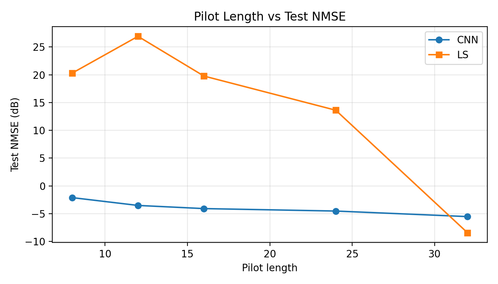
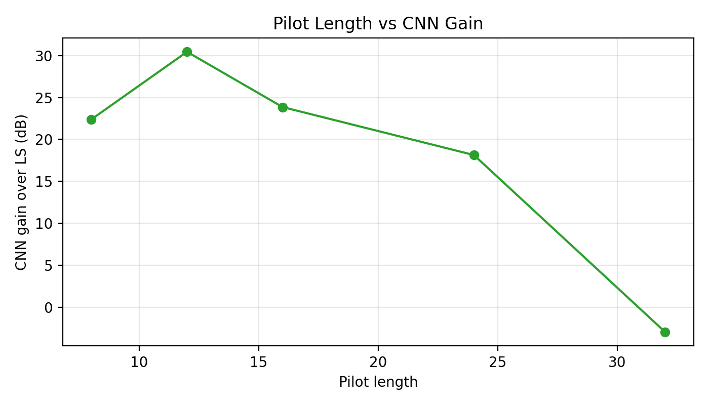
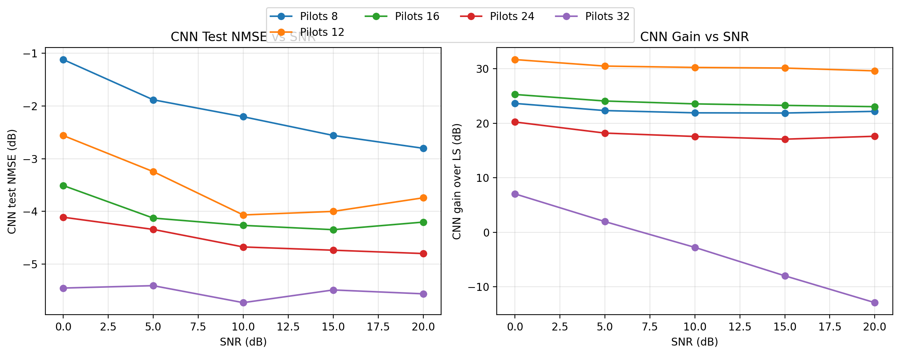

# Angular-Domain Dual CNN Update

This is the second README for the current update. It focuses only on the newer angular-domain support-estimation method and compares it against the earlier single CNN and the classical base method, Least Squares (LS).

The original direct CNN results are documented in [README.md](README.md) and [RESULTS.md](RESULTS.md). The new angular-domain run is stored at:

[`data/runs/support_cnn_baseline_support/20260427-222403`](data/runs/support_cnn_baseline_support/20260427-222403)

## Main Update

The project now contains two learned estimators:

1. **Single CNN model**
   - Directly maps noisy pilot observations to the full cascaded channel.
   - Input shape: `2 x Q x M`
   - Output shape: `2 x M x N`
   - Architecture: compact convolutional feature extractor plus a fully connected regression head.
   - Reference run: [`data/runs/cnn_baseline/20260421-221441`](data/runs/cnn_baseline/20260421-221441)

2. **Dual CNN angular-domain model**
   - Works in the angular domain instead of directly predicting the full channel.
   - Uses two support-estimation CNNs:
     - a **row-support CNN** for BS angular support,
     - a **column-support CNN** for RIS angular support conditioned on selected BS angular rows.
   - Reconstructs the final channel from the estimated sparse angular support using a small LS solve on the selected support.
   - Updated run: [`data/runs/support_cnn_baseline_support/20260427-222403`](data/runs/support_cnn_baseline_support/20260427-222403)

The base method in both comparisons is the same LS estimator used in the original repository.

## Dataset and Evaluation Setup

Both models are evaluated on the same RIS-assisted mmWave dataset configuration. The original single-CNN run uses `data/ris_mmwave_v1`; the updated dual-CNN run uses `data/dataset_large`. Both manifests use dataset version `ris_mmwave_v1`, seed `2026`, and the same array, pilot, SNR, and split settings.

| Item | Value |
| --- | --- |
| Dataset version | `ris_mmwave_v1` |
| Single-CNN data root | `data/ris_mmwave_v1` |
| Dual-CNN data root | `data/dataset_large` |
| BS array | `4 x 4`, so `M = 16` |
| RIS array | `4 x 8`, so `N = 32` |
| Channel target | complex cascaded channel, shape `16 x 32` |
| Pilot lengths | `Q = 8, 12, 16, 24, 32` |
| SNR values | `0, 5, 10, 15, 20` dB |
| Train / val / test samples | `8000 / 1000 / 1000` per pilot length |
| Pilot phase quantization | `2-bit` |
| Metric | test NMSE in dB, lower is better |

## Model Comparison

| Pilot length `Q` | Single CNN NMSE (dB) | Dual CNN NMSE (dB) | LS NMSE (dB) | Best method |
| --- | ---: | ---: | ---: | --- |
| `8` | `-9.153` | `-2.114` | `20.281` | Single CNN |
| `12` | `-9.238` | `-3.524` | `26.912` | Single CNN |
| `16` | `-9.193` | `-4.091` | `19.765` | Single CNN |
| `24` | `-8.637` | `-4.533` | `13.615` | Single CNN |
| `32` | `-8.001` | `-5.530` | `-8.448` | LS |

### Direct Reading

- The **single CNN remains the strongest learned model** in this stored experiment.
- The **dual CNN beats LS when the pilot budget is limited**, i.e. for `Q = 8, 12, 16, 24`.
- The **dual CNN improves as pilot length increases**, from `-2.114 dB` at `Q = 8` to `-5.530 dB` at `Q = 32`.
- At `Q = 32`, the LS baseline becomes best because the pilot budget reaches the full RIS dimension `N = 32`.
- The dual CNN is more structured and interpretable, but the current implementation does not yet match the end-to-end single CNN accuracy.

## Best Result for Each Method

| Method | Best pilot length | Best test NMSE (dB) | LS at same `Q` (dB) | Gain over LS (dB) |
| --- | ---: | ---: | ---: | ---: |
| Single CNN | `12` | `-9.238` | `26.912` | `36.150` |
| Dual CNN angular support | `32` | `-5.530` | `-8.448` | `-2.918` |
| LS base method | `32` | `-8.448` | `-8.448` | `0.000` |

The strongest overall estimator is still the single CNN at `Q = 12`. The strongest dual-CNN checkpoint occurs at `Q = 32`, but it is still `2.918 dB` worse than LS at that full-pilot point.

## Dual CNN Architecture

The angular-domain method is implemented around the sparse structure of the mmWave channel.

The physical channel `H` is first represented in the angular domain:

```math
H_a = A_{BS}^{H} H A_{RIS}
```

where:

- `A_BS` is the BS UPA DFT dictionary,
- `A_RIS` is the RIS UPA DFT dictionary,
- `H_a` is expected to be sparse because the channel is generated from a small number of geometric paths.

For the stored dataset:

| Angular metadata | Value |
| --- | ---: |
| BS angular grid | `4 x 4` |
| RIS angular grid | `4 x 8` |
| BS row support count | `3` |
| RIS column support count | `2` |

The support counts come from the channel path configuration:

- BS-RIS link: `1` LoS path + `2` NLoS paths = `3` row-support components.
- RIS-UE link: `1` LoS path + `1` NLoS path = `2` column-support components.

### Stage 1: Row-Support CNN

The first CNN estimates the dominant BS angular rows.

Input:

```math
\log(1 + \sum_{n} C_{n,m})
```

where `C` is the angular correlation matrix computed from the received pilot observations and the RIS pilot codebook.

Target:

```math
\log(1 + \sum_{n} |H_a(m,n)|)
```

This converts the problem into a small `4 x 4` support-map denoising task.

### Stage 2: Column-Support CNN

After selecting the strongest BS angular rows, the second CNN estimates the RIS angular support for each selected row.

Input:

```math
\log(1 + C_{:,m})
```

Target:

```math
\log(1 + |H_a(m,:)|)
```

This is a `4 x 8` RIS support-map task.

### Final Reconstruction

After the two CNNs estimate the active angular support:

1. Select the top BS angular rows.
2. Select the top RIS angular columns for each selected row.
3. Solve for the complex angular coefficients only on that small support.
4. Transform back to the antenna domain:

```math
\hat{H} = A_{BS} \hat{H}_a A_{RIS}^{H}
```

So the dual CNN does not directly predict every complex channel coefficient. It predicts sparse angular support maps, then uses model-based reconstruction.

## Dual CNN Training Summary

| Pilot length `Q` | Best row epoch | Best column epoch | Row epochs completed | Column epochs completed | Dual CNN NMSE (dB) |
| --- | ---: | ---: | ---: | ---: | ---: |
| `8` | `13` | `15` | `21` | `23` | `-2.114` |
| `12` | `1` | `13` | `9` | `21` | `-3.524` |
| `16` | `9` | `35` | `17` | `43` | `-4.091` |
| `24` | `22` | `18` | `30` | `26` | `-4.533` |
| `32` | `8` | `21` | `16` | `29` | `-5.530` |

Unlike the single CNN, the dual CNN improves with pilot length. This is expected because the angular support selection becomes easier when more pilot observations are available.

## SNR-Level Result at `Q = 12`

`Q = 12` is important because it is the best single-CNN operating point and a strongly pilot-limited case.

| SNR (dB) | Single CNN (dB) | Dual CNN (dB) | LS (dB) |
| --- | ---: | ---: | ---: |
| `0` | `-6.930` | `-2.561` | `29.129` |
| `5` | `-8.809` | `-3.246` | `27.249` |
| `10` | `-9.950` | `-4.068` | `26.177` |
| `15` | `-10.324` | `-4.000` | `26.132` |
| `20` | `-10.175` | `-3.743` | `25.874` |

At `Q = 12`, both learned models are much better than LS. The single CNN is still clearly better than the dual CNN because it learns the complete channel regression end to end instead of depending on hard support selection.

## SNR-Level Result at `Q = 32`

`Q = 32` is the full-RIS-dimension pilot case.

| SNR (dB) | Dual CNN (dB) | LS (dB) | Dual CNN gain over LS (dB) |
| --- | ---: | ---: | ---: |
| `0` | `-5.455` | `1.608` | `7.063` |
| `5` | `-5.410` | `-3.434` | `1.976` |
| `10` | `-5.732` | `-8.489` | `-2.757` |
| `15` | `-5.491` | `-13.464` | `-7.973` |
| `20` | `-5.564` | `-18.461` | `-12.896` |

The dual CNN still behaves like a denoising estimator at low SNR, so it beats LS at `0` and `5 dB`. Once SNR increases, LS benefits from the full-rank pilot system and becomes much better.

## Figures

### Single CNN Reference


### Dual CNN Angular-Domain Update







### Dual CNN Reconstruction Examples

- [Q = 8 channel examples](data/runs/support_cnn_baseline_support/20260427-222403/pilots_8/plots/channel_examples.png)
- [Q = 12 channel examples](data/runs/support_cnn_baseline_support/20260427-222403/pilots_12/plots/channel_examples.png)
- [Q = 16 channel examples](data/runs/support_cnn_baseline_support/20260427-222403/pilots_16/plots/channel_examples.png)
- [Q = 24 channel examples](data/runs/support_cnn_baseline_support/20260427-222403/pilots_24/plots/channel_examples.png)
- [Q = 32 channel examples](data/runs/support_cnn_baseline_support/20260427-222403/pilots_32/plots/channel_examples.png)

## Technical Interpretation

The single CNN is a direct learned inverse map. It sees the noisy observations and predicts the full cascaded channel. This gives it high flexibility, and in the stored results that flexibility produces the best NMSE.

The dual CNN is a hybrid model-based and learning-based estimator. It uses CNNs only for support estimation, then reconstructs the channel through the angular-domain sparse model. This makes the method easier to explain physically because it follows the sparse mmWave assumption, but it also introduces two error-sensitive steps:

- row support can be selected incorrectly,
- column support can be selected incorrectly,
- hard top-k support selection can discard useful weak paths,
- coefficient recovery is limited to the selected support only.

Because of this, the current dual CNN is best viewed as an interpretable angular-domain baseline, not yet as the top-performing estimator.

## Current Conclusion

The updated angular-domain dual CNN successfully adds a sparse, physically motivated estimator to the project. It improves clearly over LS in the reduced-pilot regime, especially when `Q < 32`, but it does not yet outperform the earlier direct single CNN.

The final comparison is:

- **Best reduced-pilot method:** single CNN at `Q = 12`, with `-9.238 dB` NMSE.
- **Best angular dual-CNN result:** dual CNN at `Q = 32`, with `-5.530 dB` NMSE.
- **Best base LS result:** LS at `Q = 32`, with `-8.448 dB` NMSE.

For reporting, the most accurate statement is:

> The angular-domain dual CNN introduces a structured support-learning approach that is more physically interpretable than the direct CNN and substantially better than LS when pilots are limited. However, the current stored result shows that the direct single CNN remains the strongest learned estimator in absolute NMSE, while LS becomes strongest once the pilot budget reaches the full RIS dimension.
