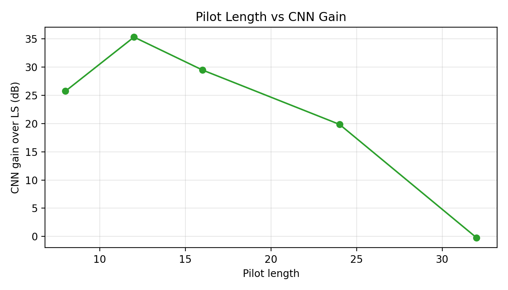

# Angular-Domain Dual CNN Update

This second README focuses on the current angular-domain update. It compares three estimators:

1. **Single CNN:** the original direct CNN channel regressor.
2. **Updated angular dual CNN:** two angular support CNNs plus a residual refinement CNN.
3. **Base method:** classical Least Squares (LS).

The original direct-CNN reference is documented in [README.md](README.md) and [RESULTS.md](RESULTS.md). The latest angular-domain run is:

[`data/runs/support_cnn_baseline/20260511-095810`](data/runs/support_cnn_baseline/20260511-095810)

## Current Main Result

The updated angular-domain model is now competitive with the single CNN and is best among learned methods at `Q = 16`.

| Method | Best pilot length | Best test NMSE (dB) | LS at same `Q` (dB) | Gain over LS (dB) |
| --- | ---: | ---: | ---: | ---: |
| Single CNN | `12` | `-9.238` | `26.912` | `36.150` |
| Updated angular dual CNN | `16` | `-9.709` | `19.765` | `29.473` |
| LS base method | `32` | `-8.448` | `-8.448` | `0.000` |

Important reading:

- The updated angular model reaches `-9.709 dB` at `Q = 16`, which is better than the original single CNN result at the same pilot length.
- The single CNN still has the strongest reduced-pilot gain over LS at `Q = 12`.
- LS is still best at `Q = 32`, where the pilot length equals the RIS dimension `N = 32`.
- The updated angular model is no longer just a support estimator. It now performs sparse angular reconstruction and then learns a residual correction.

## Dataset and Evaluation Setup

The single-CNN and angular-CNN runs use the same RIS-assisted mmWave dataset configuration. The original single-CNN run uses `data/ris_mmwave_v1`; the updated angular run uses `data/dataset_large`. Both use dataset version `ris_mmwave_v1`, seed `2026`, and the same array, pilot, SNR, and split settings.

| Item | Value |
| --- | --- |
| Dataset version | `ris_mmwave_v1` |
| Single-CNN data root | `data/ris_mmwave_v1` |
| Updated angular-CNN data root | `data/dataset_large` |
| BS array | `4 x 4`, so `M = 16` |
| RIS array | `4 x 8`, so `N = 32` |
| Channel target | complex cascaded channel, shape `16 x 32` |
| Pilot lengths | `Q = 8, 12, 16, 24, 32` |
| SNR values | `0, 5, 10, 15, 20` dB |
| Train / val / test samples | `8000 / 1000 / 1000` per pilot length |
| Pilot phase quantization | `2-bit` |
| Metric | test NMSE in dB, lower is better |

## Model Comparison

| Pilot length `Q` | Single CNN NMSE (dB) | Updated angular dual CNN NMSE (dB) | LS NMSE (dB) | Best method |
| --- | ---: | ---: | ---: | --- |
| `8` | `-9.153` | `-5.458` | `20.281` | Single CNN |
| `12` | `-9.238` | `-8.394` | `26.912` | Single CNN |
| `16` | `-9.193` | `-9.709` | `19.765` | Updated angular dual CNN |
| `24` | `-8.637` | `-6.233` | `13.615` | Single CNN |
| `32` | `-8.001` | `-8.230` | `-8.448` | LS |

### Direct Reading

- The updated angular dual CNN beats LS for all reduced-pilot cases: `Q = 8, 12, 16, 24`.
- It also stays very close to LS at `Q = 32`, with only a `0.218 dB` gap.
- The strongest angular result is `Q = 16`, with `-9.709 dB` test NMSE.
- Compared with the older April angular-support result, the refinement stage is the major improvement.

## Updated Architecture

The current method has three learned stages:

1. **Row-support CNN**
2. **Column-support CNN**
3. **Residual refinement CNN**

The first two stages operate in the angular domain. The third stage learns the remaining channel error after sparse angular reconstruction.

### Angular Representation

The physical channel `H` is represented in the angular domain as:

```math
H_a = A_{BS}^{H} H A_{RIS}
```

where:

- `A_BS` is the BS UPA DFT dictionary,
- `A_RIS` is the RIS UPA DFT dictionary,
- `H_a` is expected to be sparse because the synthetic mmWave channel has only a small number of paths.

For this dataset:

| Angular metadata | Value |
| --- | ---: |
| BS angular grid | `4 x 4` |
| RIS angular grid | `4 x 8` |
| BS row support count | `3` |
| RIS column support count | `2` |

The support counts come from the path setup:

- BS-RIS link: `1` LoS path + `2` NLoS paths = `3` row-support components.
- RIS-UE link: `1` LoS path + `1` NLoS path = `2` column-support components.

### Stage 1: Row-Support CNN

The row-support CNN estimates the dominant BS angular rows from the angular correlation matrix `C`.

Input:

```math
\log(1 + \sum_n C_{n,m})
```

Target:

```math
\log(1 + \sum_n |H_a(m,n)|)
```

This is a small `4 x 4` support-map denoising task.

### Stage 2: Column-Support CNN

After the strongest BS angular rows are selected, the column-support CNN estimates the RIS angular support for each selected row.

Input:

```math
\log(1 + C_{:,m})
```

Target:

```math
\log(1 + |H_a(m,:)|)
```

This is a `4 x 8` RIS support-map denoising task.

### Stage 3: Residual Refinement CNN

The updated [trainer.py](src/ris_training/trainer.py) adds a third stage after support reconstruction.

First, the support CNNs produce a sparse angular estimate:

```math
\hat{H}_{sparse} = A_{BS} \hat{H}_a A_{RIS}^{H}
```

Then the refinement CNN learns the residual:

```math
R = H - \hat{H}_{sparse}
```

At inference time, the final estimate is:

```math
\hat{H} = \hat{H}_{sparse} + \hat{R}_{CNN}
```

This is why the May 11 result is much stronger than the earlier support-only angular model. The support CNNs provide a physically structured first estimate, and the refinement CNN corrects the remaining full-channel error.

## Updated Angular Run Summary

Source: [`data/runs/support_cnn_baseline/20260511-095810/pilot_length_summary.csv`](data/runs/support_cnn_baseline/20260511-095810/pilot_length_summary.csv)

| Pilot length `Q` | Best epoch | Epochs completed | Angular CNN val NMSE (dB) | Angular CNN test NMSE (dB) | LS test NMSE (dB) | Gain over LS (dB) |
| --- | ---: | ---: | ---: | ---: | ---: | ---: |
| `8` | `45` | `53` | `-5.501` | `-5.458` | `20.281` | `25.739` |
| `12` | `48` | `56` | `-8.357` | `-8.394` | `26.912` | `35.306` |
| `16` | `28` | `36` | `-9.806` | `-9.709` | `19.765` | `29.473` |
| `24` | `43` | `51` | `-6.420` | `-6.233` | `13.615` | `19.848` |
| `32` | `21` | `29` | `-8.283` | `-8.230` | `-8.448` | `-0.218` |

## Stage-Level Training Summary

| Pilot length `Q` | Best row epoch | Best column epoch | Best refinement epoch | Row epochs completed | Column epochs completed | Refinement epochs completed |
| --- | ---: | ---: | ---: | ---: | ---: | ---: |
| `8` | `13` | `15` | `45` | `21` | `23` | `53` |
| `12` | `11` | `20` | `48` | `19` | `28` | `56` |
| `16` | `15` | `10` | `28` | `23` | `18` | `36` |
| `24` | `1` | `35` | `43` | `9` | `43` | `51` |
| `32` | `19` | `20` | `21` | `27` | `28` | `29` |

The refinement epoch dominates the selected `best_epoch` in most pilot settings. This matches the new training flow: row and column support models are trained first, sparse predictions are generated, and then the refinement CNN is trained against the residual channel error.

## SNR-Level Result at Best Angular Point: `Q = 16`

| SNR (dB) | Updated angular dual CNN (dB) | Single CNN at `Q = 16` (dB) | LS (dB) |
| --- | ---: | ---: | ---: |
| `0` | `-7.250` | `-7.558` | `21.778` |
| `5` | `-9.644` | `-8.951` | `19.963` |
| `10` | `-10.293` | `-9.892` | `19.296` |
| `15` | `-10.691` | `-9.882` | `18.939` |
| `20` | `-10.666` | `-9.685` | `18.848` |

At `Q = 16`, the updated angular model is slightly worse than the single CNN at `0 dB`, but better at `5, 10, 15, 20 dB`. This explains why its average test NMSE is better at this pilot length.

## SNR-Level Result at `Q = 32`

| SNR (dB) | Updated angular dual CNN (dB) | LS (dB) | Angular gain over LS (dB) |
| --- | ---: | ---: | ---: |
| `0` | `-7.750` | `1.608` | `9.358` |
| `5` | `-8.063` | `-3.434` | `4.630` |
| `10` | `-8.518` | `-8.489` | `0.029` |
| `15` | `-8.325` | `-13.464` | `-5.139` |
| `20` | `-8.495` | `-18.461` | `-9.966` |

At full pilot length, the angular model still behaves like a learned denoiser at low SNR, but LS becomes stronger at high SNR because the measurement system is no longer underdetermined.

## Figures

### Original Single CNN Reference


### Updated Angular-Domain Run





### Reconstruction Examples

- [Q = 8 channel examples](data/runs/support_cnn_baseline/20260511-095810/pilots_8/plots/channel_examples.png)
- [Q = 12 channel examples](data/runs/support_cnn_baseline/20260511-095810/pilots_12/plots/channel_examples.png)
- [Q = 16 channel examples](data/runs/support_cnn_baseline/20260511-095810/pilots_16/plots/channel_examples.png)
- [Q = 24 channel examples](data/runs/support_cnn_baseline/20260511-095810/pilots_24/plots/channel_examples.png)
- [Q = 32 channel examples](data/runs/support_cnn_baseline/20260511-095810/pilots_32/plots/channel_examples.png)

### Refinement Training Curves

- [Q = 8 refinement NMSE curve](data/runs/support_cnn_baseline/20260511-095810/pilots_8/plots/refinement_nmse_curve.png)
- [Q = 12 refinement NMSE curve](data/runs/support_cnn_baseline/20260511-095810/pilots_12/plots/refinement_nmse_curve.png)
- [Q = 16 refinement NMSE curve](data/runs/support_cnn_baseline/20260511-095810/pilots_16/plots/refinement_nmse_curve.png)
- [Q = 24 refinement NMSE curve](data/runs/support_cnn_baseline/20260511-095810/pilots_24/plots/refinement_nmse_curve.png)
- [Q = 32 refinement NMSE curve](data/runs/support_cnn_baseline/20260511-095810/pilots_32/plots/refinement_nmse_curve.png)

## Technical Interpretation

The original single CNN learns one direct inverse map from noisy pilot observations to the full cascaded channel. This is flexible and remains very strong in the reduced-pilot regime.

The updated angular method is more structured:

1. Convert observations into angular correlation features.
2. Estimate BS angular row support.
3. Estimate RIS angular column support.
4. Reconstruct a sparse angular channel on the selected support.
5. Train a refinement CNN to predict the residual error left by the sparse reconstruction.

The residual refinement stage is the key update. Earlier support-only results were physically interpretable but weaker in NMSE. The May 11 result shows that combining angular support estimation with residual correction closes much of the gap and even beats the single CNN at `Q = 16`.

## Current Conclusion

The updated angular-domain model is now a hybrid estimator:

```text
Angular support CNNs -> sparse model-based reconstruction -> residual CNN correction
```

The best stored result is:

- **Best single CNN:** `-9.238 dB` at `Q = 12`
- **Best updated angular dual CNN:** `-9.709 dB` at `Q = 16`
- **Best LS:** `-8.448 dB` at `Q = 32`

For reporting, the most accurate statement is:

> The updated angular-domain dual CNN uses learned row and column support estimation followed by residual CNN refinement. This makes the method both physically structured and competitive with the direct CNN. In the latest run, it achieves the best learned result at `Q = 16` with `-9.709 dB` NMSE and improves over LS by `29.473 dB`; LS only remains strongest at the full pilot setting `Q = 32`.
