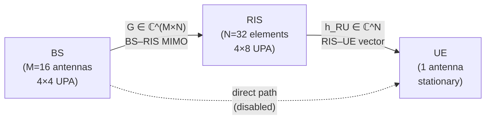
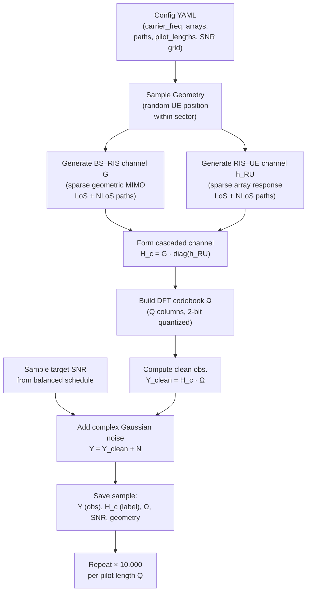
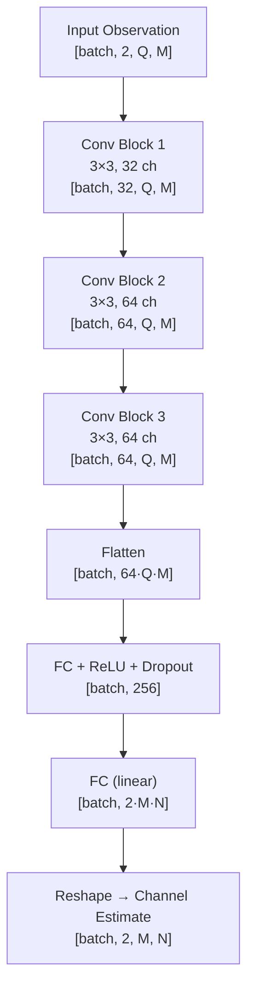
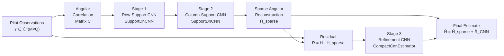
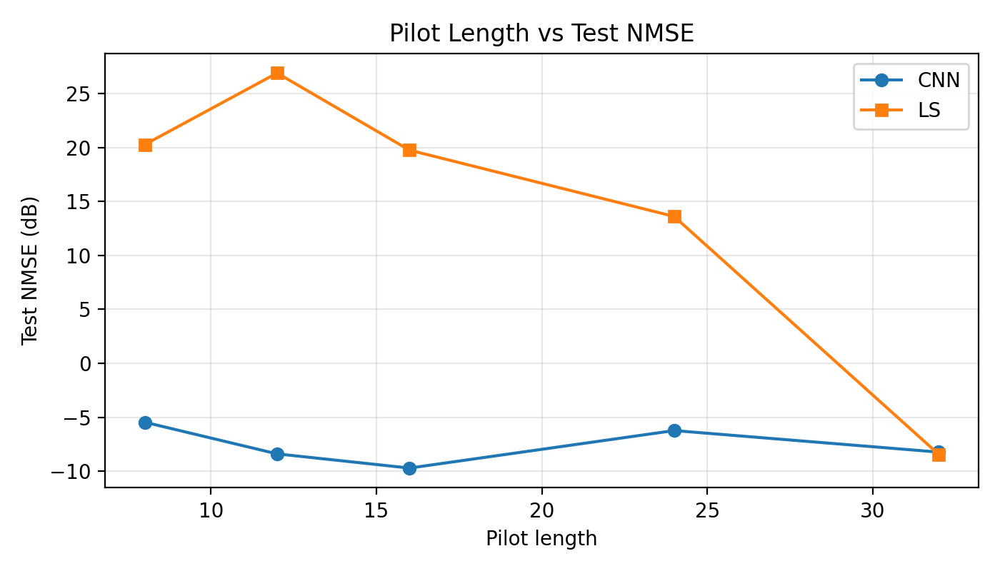
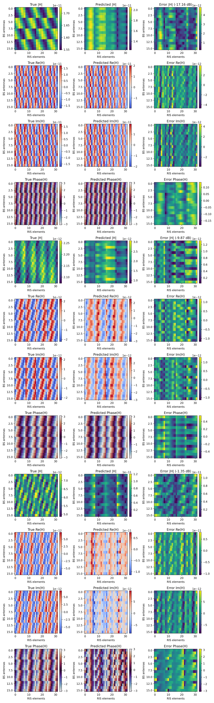
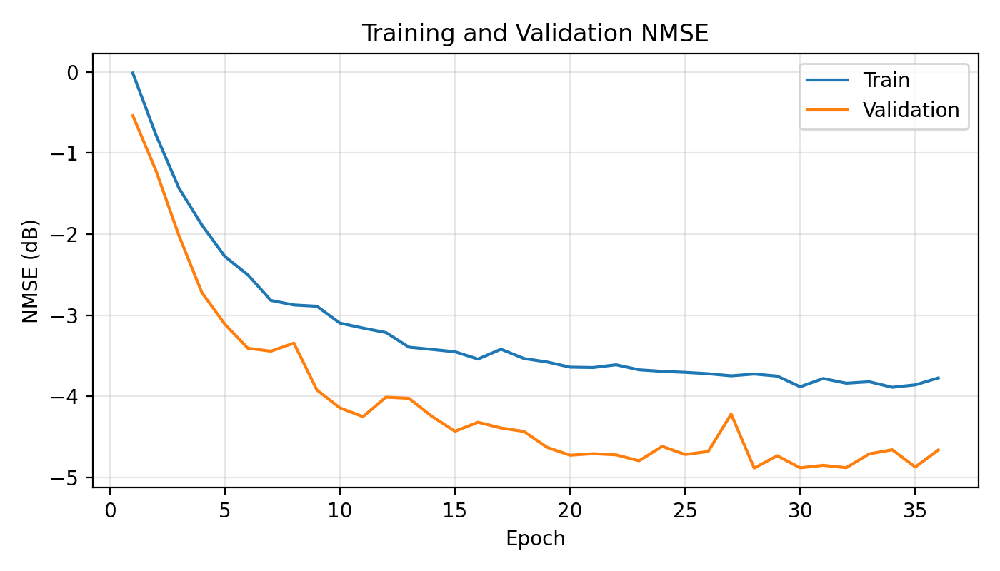
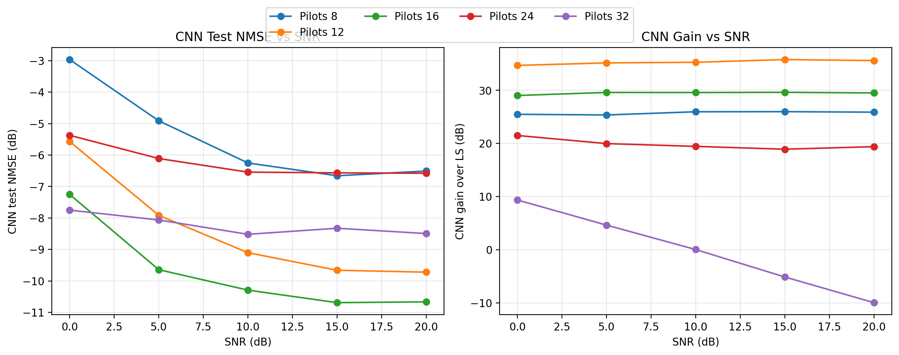

# Pilot-Optimized CNN for RIS-Assisted mmWave Channel Estimation

**A Comparative Study of Least Squares, Direct CNN, and Angular-Domain Dual CNN Estimators**

---

*Department of Electronics and Communication Engineering*
*B.Tech / M.Tech Project Report — Academic Year 2025–2026*

---

## Abstract

Reconfigurable Intelligent Surfaces (RIS) have emerged as a transformative enabling technology for next-generation millimeter-wave (mmWave) wireless networks, offering passive beamforming gain without active radio-frequency chains. A critical challenge in deploying RIS-assisted systems is the accurate estimation of the cascaded base station–RIS–user channel from a limited number of pilot observations. Classical estimators such as Least Squares (LS) fail severely when the pilot budget is smaller than the RIS dimension, because the resulting measurement system is fundamentally rank-deficient.

This report presents a complete, reproducible experimental study of three progressively sophisticated channel estimation approaches applied to a synthetically generated narrowband RIS-assisted mmWave dataset. Starting from the LS baseline, we train a compact Convolutional Neural Network (CNN) that directly regresses the full cascaded channel from noisy pilot observations, achieving up to **36.15 dB improvement** over LS at a pilot length of \(Q = 12\). We then propose and evaluate an angular-domain dual CNN architecture that decomposes the estimation into three learned stages: row-support estimation, column-support estimation, and residual refinement. The dual CNN reaches **−9.709 dB** Normalized Mean Square Error (NMSE) at \(Q = 16\)—surpassing both the single CNN and LS at that pilot setting.

The results demonstrate that learned priors over the sparse geometric structure of mmWave channels dramatically outperform classical inversion in the pilot-limited regime. The limitations of the current synthetic dataset and single-user stationary setup motivate a future research direction using reinforcement learning for multi-user, mobile RIS channel estimation.

---

## Table of Contents

1. [Introduction and Problem Statement](#1-introduction-and-problem-statement)
2. [Literature Review](#2-literature-review)
3. [System Model and Synthetic Data Generation](#3-system-model-and-synthetic-data-generation)
4. [Base Paper Implementation: LS and Single CNN](#4-base-paper-implementation-ls-and-single-cnn)
5. [Limitations of Existing Work](#5-limitations-of-existing-work)
6. [Proposed Methodology: Angular-Domain Dual CNN](#6-proposed-methodology-angular-domain-dual-cnn)
7. [Results and Comparative Analysis](#7-results-and-comparative-analysis)
8. [Conclusion and Future Scope](#8-conclusion-and-future-scope)
9. [References](#9-references)

---

## 1. Introduction and Problem Statement

### 1.1 The mmWave Channel Estimation Challenge

The global demand for wireless data capacity has driven the industry toward millimeter-wave (mmWave) frequency bands, spanning roughly 30 GHz to 300 GHz. mmWave systems offer vast available spectrum—potentially tens of gigahertz of contiguous bandwidth—enabling multi-Gbps peak data rates. However, mmWave propagation is fundamentally different from sub-6 GHz: path loss scales quadratically with frequency, atmospheric absorption is significant, and penetration through building materials is poor. These characteristics make mmWave channels **sparse in the angular domain**: only a small number of dominant propagation paths (typically one line-of-sight plus two to four non-line-of-sight paths) carry significant energy.

To compensate for high path loss, mmWave base stations and user equipment deploy large antenna arrays. Forming a directional beam at the transmitter and receiver is essential to achieve acceptable link quality. This process—beamforming—requires knowledge of the wireless channel, which must be estimated from received pilot signals. In large-array systems, the pilot overhead required to estimate the full channel can be prohibitive, consuming a significant fraction of the available time-frequency resources that would otherwise carry data.

### 1.2 Reconfigurable Intelligent Surfaces

Reconfigurable Intelligent Surfaces (RIS) are planar arrays of low-cost passive reflecting elements, each capable of independently shifting the phase of an impinging electromagnetic wave. Unlike active relays or repeaters, RIS elements neither amplify nor decode signals; they simply reflect incoming energy with a programmable phase shift. By coordinating the phase shifts across all \(N\) elements, the RIS can constructively superimpose its reflections at the intended receiver location, effectively creating a directed reflected beam without any transmit power at the surface.

The architecture of an RIS-assisted communication system is shown below.

```
┌─────────────────────────────────────────────────────┐
│                                                     │
│   ┌───────┐    G (BS–RIS)     ┌───────┐             │
│   │  BS   │ ─────────────▶   │ RIS   │             │
│   │(M ant)│                   │(N el.)│             │
│   └───────┘                   └───────┘             │
│       │                          │  h_RU (RIS–UE)   │
│       │  ~~~ (direct, disabled) ~~~                 │
│       │                          ▼                  │
│       │                      ┌───────┐              │
│       └────────────────────▶│  UE   │              │
│                              │(1 ant)│              │
│                              └───────┘              │
└─────────────────────────────────────────────────────┘
```



**Figure 1: RIS-assisted communication system model.** The BS transmits to the UE exclusively via the RIS reflection path. The cascaded channel \(\mathbf{H}_c = \mathbf{G}\,\mathrm{diag}(\mathbf{h}_{RU})\) must be estimated.

### 1.3 The Cascaded Channel Estimation Problem

When a base station (BS) with \(M\) antennas communicates with a single-antenna user exclusively through an RIS with \(N\) passive elements, the effective baseband channel seen at the BS receiver during uplink pilot transmission is the **cascaded channel**:

```math
\mathbf{H}_c = \mathbf{G}\,\mathrm{diag}(\mathbf{h}_{RU}) \;\in\; \mathbb{C}^{M \times N}
```

where \(\mathbf{G} \in \mathbb{C}^{M \times N}\) is the BS–RIS MIMO channel and \(\mathbf{h}_{RU} \in \mathbb{C}^N\) is the RIS–UE vector channel. The system cannot observe \(\mathbf{G}\) and \(\mathbf{h}_{RU}\) separately; only their product through the RIS phase configuration is accessible. This is the **cascaded channel estimation problem**.

### 1.4 Pilot Overhead and the Core Research Question

To estimate \(\mathbf{H}_c\), the user transmits a pilot signal through \(Q\) different RIS phase configurations (the **pilot length**). The received observation matrix at the BS is:

```math
\mathbf{Y} = \mathbf{H}_c\,\mathbf{\Omega} + \mathbf{N} \;\in\; \mathbb{C}^{M \times Q}
```

where \(\mathbf{\Omega} \in \mathbb{C}^{N \times Q}\) is the RIS pilot codebook and \(\mathbf{N}\) is complex Gaussian noise.

For the system to be non-underdetermined, we need at least \(Q \geq N\) pilot transmissions. For a 32-element RIS, this means \(Q \geq 32\) — a substantial overhead. In practice, the pilot budget is severely constrained by the coherence time of the channel and the duplex constraint of the air interface.

**The central research question of this project is:**

> *Can a compact deep learning model recover the RIS-assisted cascaded channel accurately when the pilot budget \(Q \ll N\), dramatically outperforming classical Least Squares estimation?*

The answer, demonstrated empirically across multiple experiments, is yes: at \(Q = 12\), a CNN improves over LS by **36.15 dB**. The follow-up question is whether exploiting the known angular sparsity of mmWave channels can push performance even further with an angular-domain dual CNN.

---

## 2. Literature Review

### 2.1 RIS-Enhanced Wireless Networks

**[1] Q. Wu and R. Zhang, "Intelligent Reflecting Surface Enhanced Wireless Network: Joint Active and Passive Beamforming Design," *IEEE Transactions on Wireless Communications*, vol. 18, no. 11, pp. 5394–5409, Nov. 2019.**

Wu and Zhang established the foundational framework for jointly optimizing the BS beamforming vector and the RIS phase shifts to maximize spectral efficiency. They showed that an RIS with \(N\) passive elements can increase the received SNR by a factor of \(N^2\) when the phase shifts are perfectly aligned—a so-called "squared array gain." Their alternating optimization approach for the joint active and passive beamforming design became the standard baseline formulation. Crucially, their work assumes perfect channel state information (CSI), motivating a large body of subsequent research into how that CSI can be acquired in practice with limited overhead.

**Key insight for this project:** Perfect CSI is assumed in the beamforming literature, but acquiring it is nontrivial. This work motivates the channel estimation problem we address.

**[2] C. Huang, A. Zappone, G. C. Alexandropoulos, M. Debbah, and C. Yuen, "Reconfigurable Intelligent Surfaces for Energy Efficiency in Wireless Communication," *IEEE Transactions on Wireless Communications*, vol. 18, no. 8, pp. 4157–4170, Aug. 2019.**

Huang et al. studied RIS from the energy efficiency perspective, comparing RIS-assisted systems against massive MIMO and decode-and-forward relays under a total power budget. They found that under practical power constraints, a large-RIS system can achieve similar spectral efficiency to massive MIMO with significantly lower energy consumption, because the RIS elements are passive. This paper also explicitly noted the challenge of acquiring cascaded channel knowledge and proposed a compressive sensing-based pilot reduction scheme.

**Key insight for this project:** Reducing pilot overhead is not merely a convenience—it is a fundamental requirement for energy-efficient RIS deployment because long pilot sequences waste the coherence window that active data transmission requires.

**[3] J. He, H. Wymeersch, L. Kong, O. Silvén, and M. Juntti, "Large Intelligent Surface for Positioning in Millimeter Wave MIMO Systems," in *Proc. IEEE Vehicular Technology Conference (VTC)*, Apr. 2020; and specifically for the estimation angle: J. He et al., "Deep Learning-Based Channel Estimation for RIS-Assisted mmWave Systems," *IEEE Wireless Communications Letters*, vol. 10, no. 11, pp. 2427–2431, Nov. 2021.**

He et al. were among the first to directly apply deep learning to the RIS cascaded channel estimation problem in the mmWave regime. Their key contribution was demonstrating that a CNN trained on simulated channel samples can invert the underdetermined pilot observation system using learned geometric priors, outperforming Orthogonal Matching Pursuit (OMP) and LS by a large margin in the pilot-limited regime. They exploited the angular-domain sparsity of mmWave channels as a training-time regularizer, even without explicitly enforcing it during inference. Their results confirmed that the pilot-to-channel mapping is learnable from data, providing the direct inspiration for the work in this report.

**Key insight for this project:** A CNN acting as a learned regularizer for the underdetermined LS system is the architectural philosophy underlying both the single CNN and the angular dual CNN developed here.

### 2.2 Classical Channel Estimation for RIS Systems

Before deep learning methods became prevalent, RIS channel estimation relied on compressive sensing and sparse recovery. The dominant approaches were:

- **Least Squares (LS):** The minimum-norm solution \(\hat{\mathbf{H}}_{LS} = \mathbf{Y}\mathbf{\Omega}^\dagger\), which is optimal under full-rank measurement but degrades catastrophically when \(Q < N\).
- **Orthogonal Matching Pursuit (OMP):** A greedy pursuit algorithm that exploits angular-domain sparsity to recover the channel from fewer pilots than the RIS dimension.
- **MMSE estimation:** Requires knowledge of the channel covariance matrix, which is expensive to estimate and may not be stationary across users.

The fundamental limitation of these classical approaches is that they either fail in the underdetermined regime (LS, MMSE) or require accurate sparsity level knowledge and are computationally expensive at test time (OMP).

### 2.3 Deep Learning for Channel Estimation

Deep learning methods have shown remarkable performance in wireless channel estimation tasks because neural networks can learn problem-specific priors from training data. In the RIS context, several architectural families have been explored:

- **Direct regression CNNs:** Map pilot observations directly to estimated channels without any explicit signal processing step.
- **Model-based unrolling networks:** Unroll the iterations of an iterative algorithm (e.g., ADMM or AMP) as neural network layers, combining the interpretability of model-based methods with the adaptability of data-driven training.
- **Angular-domain networks:** Transform the channel into the angular (Fourier) domain, where mmWave channels are sparse, and learn the sparse support before reconstructing the spatial-domain channel.
- **Transformer-based estimators:** Use attention mechanisms to capture long-range dependencies between antenna pairs, exploiting global spatial structure.

This project implements direct regression CNN and angular-domain dual CNN approaches, which represent a natural evolutionary progression from classical to learned estimation.

---

## 3. System Model and Synthetic Data Generation

### 3.1 Network Geometry

The simulated environment consists of three fixed-or-mobile nodes:

| Node | Position | Configuration |
|------|----------|---------------|
| Base Station (BS) | \((0,\,0,\,8)\) m | 4×4 UPA, \(M = 16\) antennas |
| RIS | \((20,\,0,\,5)\) m | 4×8 UPA, \(N = 32\) elements |
| User Equipment (UE) | Random in sector | Single antenna |

The UE is placed uniformly at random in a sector defined by:
- Radius: \(r \in [5, 25]\) m from the RIS
- Azimuth: \(\varphi \in [-60°, 60°]\)
- Height: \(z = 1.5\) m

The direct BS–UE path is intentionally disabled, so all energy reaches the UE only via the RIS reflection. This isolates the cascaded channel estimation problem cleanly.

### 3.2 Uniform Planar Array (UPA) Steering Vector

Both the BS and RIS are modeled as Uniform Planar Arrays (UPAs). For an array with \(N_r\) rows and \(N_c\) columns and half-wavelength element spacing (\(d/\lambda = 0.5\)), the normalized steering vector for azimuth \(\phi\) and elevation \(\theta\) is:

```math
\mathbf{a}(\phi,\theta)
= \frac{1}{\sqrt{N_r N_c}}
\exp\!\left(j 2\pi \frac{d}{\lambda}
\left[r \sin\phi\cos\theta + c \sin\theta\right]\right)
\;\in\; \mathbb{C}^{N_r N_c}
```

where \(r = 0, 1, \ldots, N_r-1\) and \(c = 0, 1, \ldots, N_c-1\) index the row and column of each element, and the expression is evaluated element-wise. The \(1/\sqrt{N_r N_c}\) factor ensures unit-norm steering vectors, which simplifies the path gain normalization.

In Python (from `src/ris_dataset/channels.py`):

```python
row_spatial = np.sin(azimuth) * np.cos(elevation)
col_spatial = np.sin(elevation)
phase = 2.0 * np.pi * spacing_lambda * (
    row_indices * row_spatial + col_indices * col_spatial
)
return np.exp(1j * phase).reshape(-1) / np.sqrt(array_config.size)
```

### 3.3 Sparse BS–RIS MIMO Channel

The BS–RIS channel \(\mathbf{G} \in \mathbb{C}^{M \times N}\) is modeled as a geometric sparse MIMO channel with \(L_{BR}\) paths:

```math
\mathbf{G}
= \sum_{\ell=1}^{L_{BR}}
\frac{\alpha_\ell}{\sqrt{L_{BR}}}
\;\mathbf{a}_{BS}\!\left(\phi^{rx}_\ell, \theta^{rx}_\ell\right)
\mathbf{a}_{RIS}\!\left(\phi^{tx}_\ell, \theta^{tx}_\ell\right)^H
```

where:
- \(\alpha_\ell \in \mathbb{C}\) is the complex path gain for the \(\ell\)-th path
- \(\phi^{rx}_\ell, \theta^{rx}_\ell\) are the angles-of-arrival at the BS
- \(\phi^{tx}_\ell, \theta^{tx}_\ell\) are the angles-of-departure from the RIS
- \(L_{BR} = 3\): one LoS path and two NLoS paths

The normalization by \(1/\sqrt{L_{BR}}\) keeps the total channel energy constant regardless of path count.

**Line-of-Sight (LoS) path:** The LoS angles are derived from the actual geometry. A small angular jitter with standard deviation \(\sigma_{jitter} = 2°\) is applied to secondary paths to model near-LoS components.

**Non-Line-of-Sight (NLoS) paths:** NLoS angles are drawn uniformly:

```math
\phi^{tx/rx} \sim \mathcal{U}\!\left(-\frac{\pi}{2}, \frac{\pi}{2}\right), \quad
\theta^{tx/rx} \sim \mathcal{U}\!\left(-\frac{\pi}{6}, \frac{\pi}{6}\right)
```

### 3.4 Sparse RIS–UE Vector Channel

The RIS–UE channel \(\mathbf{h}_{RU} \in \mathbb{C}^N\) is modeled as a sparse array response vector:

```math
\mathbf{h}_{RU}
= \sum_{p=1}^{L_{RU}}
\frac{\beta_p}{\sqrt{L_{RU}}}
\;\mathbf{a}_{RIS}\!\left(\phi_p, \theta_p\right)
```

where \(L_{RU} = 2\): one LoS and one NLoS path. The geometry of each sample determines the LoS angle from the random user position.

### 3.5 Complex Path Gain Model

Each complex path gain \(\alpha_\ell\) (or \(\beta_p\)) is the product of a large-scale path loss component and a small-scale fading coefficient.

#### 3.5.1 Close-In Path Loss Model

The large-scale attenuation follows the Close-In (CI) free-space reference path loss model:

```math
\text{PL}(d)\;[\text{dB}]
= 32.4 + 20\log_{10}(f_{\text{GHz}}) + 10\,n\,\log_{10}(d) + \chi_\sigma
```

where:
- \(f_{\text{GHz}} = 28\) GHz is the carrier frequency
- \(d\) is the link distance in meters
- \(n\) is the path-loss exponent (\(n_{LoS} = 2.1\), \(n_{NLoS} = 3.4\))
- \(\chi_\sigma \sim \mathcal{N}(0, \sigma^2)\) is log-normal shadowing (\(\sigma_{LoS} = 3.6\) dB, \(\sigma_{NLoS} = 9.7\) dB)

The amplitude attenuation is then:

```math
a(d) = 10^{-\text{PL}(d)/20}
```

#### 3.5.2 Small-Scale Fading

For LoS paths, the complex gain is:

```math
\alpha_\ell^{LoS} = a(d)\,\sqrt{\sigma_{LoS}^2}\,e^{j\psi_\ell}, \quad
\psi_\ell \sim \mathcal{U}(0, 2\pi)
```

For NLoS paths, the small-scale fading is complex Gaussian (Rayleigh):

```math
\alpha_\ell^{NLoS} = a(d_\text{eff})\,\sqrt{\frac{\sigma_{NLoS}^2}{2}}\,(g_R + jg_I), \quad
g_R, g_I \sim \mathcal{N}(0, 1)
```

where \(d_\text{eff} = d \cdot \nu\) with \(\nu \sim \mathcal{U}(1.05, 1.5)\) models a longer effective path for scattered NLoS components.

Default gain variances: \(\sigma_{LoS}^2 = 1.0\), \(\sigma_{NLoS}^2 = 0.01\).

### 3.6 Cascaded Channel

The learning target is the full cascaded BS–RIS–UE channel:

```math
\mathbf{H}_c = \mathbf{G}\,\mathrm{diag}(\mathbf{h}_{RU})
= \mathbf{G} \odot \mathbf{1}_M\,\mathbf{h}_{RU}^T
\;\in\; \mathbb{C}^{M \times N}
```

where \(\odot\) denotes element-wise (Hadamard) multiplication applied column-by-column. This is equivalent to right-multiplying \(\mathbf{G}\) by a diagonal matrix whose entries are the elements of \(\mathbf{h}_{RU}\), scaling each column of \(\mathbf{G}\) by the corresponding RIS-to-UE path gain.

In code:

```python
cascaded_channel = g_br * h_ru[np.newaxis, :]   # shape: (M, N)
```

### 3.7 Pilot Observation Model

During the uplink pilot phase, the user transmits a unit-power symbol and the RIS cycles through \(Q\) phase configurations encoded in the codebook matrix \(\mathbf{\Omega} \in \mathbb{C}^{N \times Q}\). The received signal at the BS is:

```math
\boxed{
\mathbf{Y} = \mathbf{H}_c\,\mathbf{\Omega} + \mathbf{N}
\;\in\; \mathbb{C}^{M \times Q}
}
```

where \(\mathbf{N} \in \mathbb{C}^{M \times Q}\) is additive white Gaussian noise with variance \(\sigma_n^2\) per complex entry (i.e., \(\sigma_n^2/2\) per real dimension). The downlink beamforming matrix \(\mathbf{W}\) is set to the identity (\(\mathbf{W} = \mathbf{I}_M\)) and the pilot symbol is fixed to 1.

### 3.8 Per-Sample SNR Control

Rather than using a fixed global noise variance, each sample draws its noise level from a target SNR:

```math
P_s = \frac{1}{MQ}\left\|\mathbf{Y}_{clean}\right\|_F^2
```

```math
\sigma_n^2 = \frac{P_s}{10^{\text{SNR}_{dB}/10}}
```

```math
\mathbf{N} = \frac{\sigma_n}{\sqrt{2}}\left(\mathbf{G}_R + j\mathbf{G}_I\right), \quad
\mathbf{G}_R, \mathbf{G}_I \sim \mathcal{N}(\mathbf{0}, \mathbf{I})
```

This ensures the SNR label exactly reflects the ratio of clean observation power to noise power for every sample individually, regardless of absolute channel amplitude variation.

### 3.9 RIS Pilot Codebook Design

The RIS phase codebook \(\mathbf{\Omega}\) is constructed deterministically from a DFT matrix to maximize coverage of the RIS angular space:

**Case \(Q \leq N\):** Take the first \(Q\) columns of the normalized \(N \times N\) DFT matrix:

```math
[\mathbf{\Omega}]_{n,q}
= \frac{1}{\sqrt{N}}\,e^{j2\pi nq/N}, \quad
n = 0,\ldots,N-1;\; q = 0,\ldots,Q-1
```

**Case \(Q > N\):** Take the first \(N\) rows of the normalized \(Q \times Q\) DFT matrix.

The continuous-phase DFT entries are then **2-bit quantized** to the nearest allowable phase:

```math
\mathcal{Q}_{2\text{-bit}} = \left\{0,\;\frac{\pi}{2},\;\pi,\;\frac{3\pi}{2}\right\}
```

This is realistic: practical RIS controllers implement discrete phase states due to hardware limitations (1-bit or 2-bit PIN diode or varactor-based phase shifters).

### 3.10 Synthetic Dataset Generation Pipeline

The data generation follows this deterministic, reproducible pipeline:



**Figure 2: Synthetic dataset generation pipeline.**

The SNR schedule is balanced: for 8000 training samples and 5 SNR values (0, 5, 10, 15, 20 dB), exactly 1600 samples fall at each SNR level, shuffled randomly. This ensures equal representation across all noise conditions.

### 3.11 Dataset Statistics

| Parameter | Value |
|-----------|-------|
| Carrier frequency | 28 GHz |
| Element spacing | \(0.5\lambda\) (half-wavelength) |
| BS array | 4×4 UPA → \(M = 16\) antennas |
| RIS array | 4×8 UPA → \(N = 32\) elements |
| Pilot lengths \(Q\) | \{8, 12, 16, 24, 32\} |
| SNR range | \{0, 5, 10, 15, 20\} dB |
| Training samples (per \(Q\)) | 8,000 |
| Validation samples (per \(Q\)) | 1,000 |
| Test samples (per \(Q\)) | 1,000 |
| Total samples across all \(Q\) | 50,000 |
| BS–RIS paths \(L_{BR}\) | 3 (1 LoS + 2 NLoS) |
| RIS–UE paths \(L_{RU}\) | 2 (1 LoS + 1 NLoS) |
| RIS phase quantization | 2-bit (\{0°, 90°, 180°, 270°\}) |
| Dataset seed | 2026 |

Each sample is stored as a complex-valued observation tensor of shape \([Q, M]\) (transposed from \([M, Q]\) for CNN spatial compatibility), and a complex channel label of shape \([M, N]\). Both are serialized as real–imaginary channel pairs of shape \([Q, M, 2]\) and \([M, N, 2]\) respectively.

---

## 4. Base Paper Implementation: LS and Single CNN

### 4.1 Least Squares Estimator

The Least Squares estimator solves the linear problem \(\mathbf{Y} \approx \mathbf{H}_c\,\mathbf{\Omega}\) by minimizing the Frobenius-norm residual:

```math
\hat{\mathbf{H}}_{LS}
= \arg\min_{\mathbf{H}} \;\left\|\mathbf{Y} - \mathbf{H}\,\mathbf{\Omega}\right\|_F^2
= \mathbf{Y}\,\mathbf{\Omega}^H \left(\mathbf{\Omega}\,\mathbf{\Omega}^H\right)^\dagger
```

where \((\cdot)^\dagger\) denotes the Moore-Penrose pseudoinverse.

**When \(Q \geq N\):** The matrix \(\mathbf{\Omega}\mathbf{\Omega}^H \in \mathbb{C}^{N \times N}\) is full-rank. For a DFT codebook, \(\mathbf{\Omega}\mathbf{\Omega}^H = \mathbf{I}_N\) (orthonormal columns), and the LS estimator reduces to a simple matched filter:

```math
\hat{\mathbf{H}}_{LS} = \mathbf{Y}\,\mathbf{\Omega}^H \quad (Q = N,\text{ DFT codebook})
```

**When \(Q < N\):** The matrix \(\mathbf{\Omega}\mathbf{\Omega}^H\) is rank-\(Q\), and the pseudoinverse projects onto only the observed \(Q\)-dimensional subspace of the full \(N\)-dimensional RIS space. The remaining \(N - Q\) angular degrees of freedom are invisible to LS and appear as large reconstruction error. This is the fundamental reason LS is catastrophically poor at \(Q < N\).

In code (`src/ris_dataset/generator.py`):

```python
def least_squares_estimate(observations: np.ndarray, omega: np.ndarray) -> np.ndarray:
    return observations @ omega.conj().T @ np.linalg.pinv(omega @ omega.conj().T)
```

### 4.2 Performance Metric: NMSE

The Normalized Mean Square Error (NMSE) is the standard metric for channel estimation quality:

```math
\text{NMSE}
= \frac{\left\|\hat{\mathbf{H}} - \mathbf{H}\right\|_F^2}{\left\|\mathbf{H}\right\|_F^2}
```

In dB (lower is better):

```math
\text{NMSE}_{dB} = 10\log_{10}\!\left(\text{NMSE}\right)
```

A perfect estimate gives \(\text{NMSE} = 0\) (\(-\infty\) dB). An uninformative estimate (zero output) gives \(\text{NMSE} = 1\) (0 dB). The LS estimator at \(Q \ll N\) gives NMSE well above 1, i.e., positive NMSE in dB, meaning the estimate is worse than simply outputting zero—a strong indicator of the estimation failure.

### 4.3 Single CNN Architecture

The direct CNN estimator learns a nonlinear map from noisy pilot observations to the full cascaded channel:

```math
f_\theta\;:\; \tilde{\mathbf{Y}} \;\longmapsto\; \hat{\tilde{\mathbf{H}}}_c
```

where \(\tilde{\mathbf{Y}}\) and \(\hat{\tilde{\mathbf{H}}}_c\) are z-score normalized versions of the observation and channel tensors.

#### 4.3.1 Input/Output Tensor Format

The observation tensor stored on disk has shape \([Q, M, 2]\) (real-imaginary pair). Before feeding to the CNN, it is transposed to channels-first format \([2, Q, M]\), where channel 0 is the real part and channel 1 is the imaginary part. Similarly, the channel target has shape \([2, M, N]\) in channels-first format.

For the large dataset (\(M = 16\), \(N = 32\)):
- Input to CNN at \(Q = 16\): \([2, 16, 16]\)
- Target: \([2, 16, 32]\)

#### 4.3.2 Normalization

Training-set statistics are computed per channel (real/imaginary):

```math
\mu_x = \frac{1}{|S_{train}|}\sum_{s \in S_{train}} \bar{x}_s, \quad
\sigma_x = \sqrt{\frac{1}{|S_{train}|}\sum_{s \in S_{train}} (x_s - \mu_x)^2}
```

Standardized inputs and targets:

```math
\tilde{x} = \frac{x - \mu_x}{\max(\sigma_x,\, \epsilon)}, \quad
\tilde{h} = \frac{h - \mu_h}{\max(\sigma_h,\, \epsilon)}
```

where \(\epsilon = 10^{-7}\) prevents division by zero. NMSE is always computed in the original (denormalized) channel space.

#### 4.3.3 Convolutional Feature Extractor

The CNN uses three convolutional blocks. Each block applies:

```math
\text{ConvBlock}(\mathbf{x}) =
\text{Dropout}_{2D}\!\left(
    \text{ReLU}\!\left(
        \text{BatchNorm}_{2D}\!\left(
            \text{Conv}_{2D}(\mathbf{x})
        \right)
    \right)
\right)
```

All convolutions use \(3 \times 3\) kernels with padding 1, so the spatial dimensions \((Q, M)\) are preserved through the entire feature extractor. The channel widths are:

```
Input:   [batch, 2,  Q, M]
Conv 1:  [batch, 32, Q, M]   (32 filters, 3×3, pad=1)
Conv 2:  [batch, 64, Q, M]   (64 filters, 3×3, pad=1)
Conv 3:  [batch, 64, Q, M]   (64 filters, 3×3, pad=1)
```

#### 4.3.4 Fully Connected Regression Head

After the convolutional stack, the feature tensor is flattened and passed through two linear layers:

```
Flatten:   [batch, 64·Q·M]
FC hidden: [batch, 256]        (ReLU + Dropout)
FC output: [batch, 2·M·N]
Reshape:   [batch, 2, M, N]
```

The output is the predicted normalized channel.



**Figure 3: Single CNN architecture.** Three convolutional blocks extract spatial features from the 2D pilot observation map, then a fully connected head regresses the full cascaded channel.

#### 4.3.5 Parameter Count

The total number of trainable parameters depends on the pilot length \(Q\):

```math
P_{CNN}(Q, M, N)
= 56448 + 16384\,Q\,M + 514\,M\,N
```

For the large dataset (\(M = 16\), \(N = 32\)):

| \(Q\) | Parameters |
|--------|-----------|
| 8 | 2,421,120 |
| 12 | 3,580,352 |
| 16 | 4,739,584 |
| 24 | 7,058,048 |
| 32 | 9,376,512 |

The growth is dominated by the first fully connected layer, which must accommodate the full \(64 \times Q \times M\) feature vector.

#### 4.3.6 Training Configuration

| Hyperparameter | Value |
|----------------|-------|
| Optimizer | AdamW |
| Learning rate | \(10^{-3}\) |
| Weight decay | \(10^{-4}\) |
| Batch size | 128 |
| Maximum epochs | 60 |
| Early stopping patience | 8 epochs |
| Model selection metric | Validation NMSE (dB) |
| Loss function | MSE on normalized channel |
| Dropout rate | 0.1 |

Training is conducted separately for each pilot length \(Q \in \{8, 12, 16, 24, 32\}$. For each \(Q\), the checkpoint with the lowest validation NMSE is selected as the "best" model and evaluated on the held-out test split.

---

## 5. Limitations of Existing Work

### 5.1 Synthetic-Only Dataset Without Real-World Sparsity

The most significant limitation of the current codebase is that **all channel samples are synthetically generated** from a parametric geometric model. While the model is physically motivated (UPA steering vectors, CI path loss, sparse path counts matching mmWave measurements), it does not capture the full complexity of real-world mmWave channel distributions:

- **Fixed path count:** Every BS–RIS sample has exactly 1 LoS + 2 NLoS paths, and every RIS–UE sample has exactly 1 LoS + 1 NLoS path. Real channels exhibit variable sparsity depending on the environment.
- **Simplified environment:** No blockage, diffraction, or material-specific scattering is modeled. Urban canyons, indoor walls, and vehicular reflectors all create non-stationary channel statistics that the synthetic model cannot reproduce.
- **No spatial non-stationarity:** The synthetic model assumes the same path-count distribution everywhere in the coverage area. Real large-array channels exhibit spatial non-stationarity where different parts of the array see different propagation clusters.
- **Training–deployment mismatch:** A CNN trained on this synthetic distribution may fail to generalize when deployed in an environment with different scattering geometry, because the learned prior is tied to the training distribution's structural assumptions.

### 5.2 Single Stationary User

The current system is explicitly scoped to **one stationary user**. This means:

- **No multi-user interference:** In a real RIS-assisted network, multiple users compete for the same time-frequency-space resources, and their channels must be estimated simultaneously. The RIS phase configurations used for one user's pilot may create interference for another.
- **No Doppler effects:** A stationary user produces a time-invariant channel within the coherence block. Mobile users cause time-varying channels, requiring the channel estimate to remain valid only for a very short window before re-estimation is needed.
- **No pilot contamination:** In multi-user scenarios, pilot sequences assigned to different users can be non-orthogonal, causing inter-user interference during channel estimation itself.

### 5.3 Architectural Scaling Problem in the Single CNN

The single CNN's parameter count grows as \(O(Q \cdot M)\) due to the flattened fully connected head. This means:

- The model architecture is not fixed-size: a separate model must be trained for each pilot length \(Q\).
- There is no weight sharing across pilot lengths, even though the underlying channel statistics are the same.
- The CNN at \(Q = 32\) has roughly 4× more parameters than at \(Q = 8\), yet empirically performs *worse* on average (\(-8.001\) dB vs. \(-9.153\) dB), suggesting the larger model is overparameterized relative to the information content.

### 5.4 No Explicit Exploitation of Channel Sparsity

The single CNN learns the channel mapping implicitly. It does not explicitly:
- Transform to the angular domain where mmWave channels are sparse
- Enforce sparsity through regularization or structured priors
- Separate the estimation into interpretable stages (support location vs. coefficient estimation)

This limits the model's ability to extrapolate to unseen pilot lengths or angular configurations and makes the learned representation opaque to physical interpretation.

### 5.5 No OMP or Compressed Sensing Baseline

The comparison is limited to LS as the classical baseline. Orthogonal Matching Pursuit (OMP) and other compressive sensing algorithms that exploit angular-domain sparsity are not included. OMP typically outperforms LS significantly in the pilot-limited regime, and its absence means the gain of the CNN over the *best classical method* is unknown from the current experiments.

---

## 6. Proposed Methodology: Angular-Domain Dual CNN

### 6.1 Motivation: Exploiting Angular Sparsity

mmWave channels are sparse in the angular (wavenumber) domain because the number of propagation paths \(L \ll MN\). The key physical insight is that the energy of the cascaded channel \(\mathbf{H}_c\) concentrates in a small number of angle-of-arrival / angle-of-departure bins when represented using a DFT dictionary.

For the synthetic dataset in this project:
- BS–RIS link: 3 paths → at most 3 dominant BS angular bins
- RIS–UE link: 2 paths → at most 2 dominant RIS angular bins

This sparsity suggests a structured estimation approach: first locate the dominant angular bins, then estimate the channel coefficients on those bins, and finally correct any reconstruction error with a learned residual.

The proposed method evolves the estimation pipeline as follows:

```
LS: direct analytical inversion (fails for Q < N)
    ↓
Single CNN: learned direct regression (strong, but black-box)
    ↓
Angular Dual CNN: angular support → sparse reconstruction → residual correction
```

### 6.2 Angular-Domain Transformation

The angular-domain representation of the cascaded channel is:

```math
\mathbf{H}_a = \mathbf{A}_{BS}^H\,\mathbf{H}_c\,\mathbf{A}_{RIS}
\;\in\; \mathbb{C}^{M \times N}
```

where:
- \(\mathbf{A}_{BS} \in \mathbb{C}^{M \times M}\) is the \(M \times M\) normalized DFT dictionary for the BS UPA (columns are BS steering vectors)
- \(\mathbf{A}_{RIS} \in \mathbb{C}^{N \times N}\) is the \(N \times N\) normalized DFT dictionary for the RIS UPA

Since the mmWave channel has only a few paths, \(\mathbf{H}_a\) is approximately sparse: most entries are near zero, with energy concentrated in a small number of positions. The row index of each nonzero entry corresponds to a BS angular bin (angle-of-arrival), and the column index corresponds to a RIS angular bin (angle-of-departure from the RIS toward the UE).

For the 4×4 BS array, the BS angular grid has 4×4 = 16 bins arranged as 4 row bins × 4 column bins. For the 4×8 RIS array, the RIS angular grid has 4×8 = 32 bins arranged as 4 row bins × 8 column bins.

### 6.3 Three-Stage Architecture

The proposed angular dual CNN decomposes the estimation into three sequential learned stages:



**Figure 4: Angular-domain dual CNN architecture.** Three sequential learned stages progressively refine the channel estimate from coarse angular support to residual correction.

### 6.4 Stage 1: Row-Support CNN

**Purpose:** Identify the dominant BS angular row bins that contain most of the channel energy.

**Angular Correlation Feature:** From the pilot observations \(\mathbf{Y}\), compute the angular correlation matrix:

```math
\mathbf{C} = \mathbf{A}_{BS}^H\,\mathbf{Y}\,\mathbf{Y}^H\,\mathbf{A}_{BS} \;\in\; \mathbb{C}^{M \times M}
```

The diagonal of \(\mathbf{C}\) reveals the energy in each BS angular bin after projection through the pilot codebook.

**Input to Row-Support CNN:**

```math
\mathbf{f}_{row} = \log\!\left(1 + \sum_n |C_{n,m}|\right) \;\in\; \mathbb{R}^{M_r \times M_c}
```

where \(M_r = 4\) and \(M_c = 4\) are the BS UPA row and column dimensions, and the sum aggregates across the angular column index.

**Target:**

```math
\mathbf{t}_{row} = \log\!\left(1 + \sum_n \left|\mathbf{H}_a(m, n)\right|\right) \;\in\; \mathbb{R}^{M_r \times M_c}
```

This is a small 4×4 support-map denoising task. The log1p transform compresses the dynamic range, making the regression problem numerically stable.

**Architecture (SupportDnCNN):** A residual denoiser with three 64-channel convolutional layers:

```math
\hat{\mathbf{t}} = \mathbf{f} - \mathcal{R}(\mathbf{f})
```

where \(\mathcal{R}\) is a CNN that learns to predict the noise component in the correlation feature, and subtraction gives the denoised support estimate. This is the DnCNN residual learning architecture.

**Row Support Selection:** The top \(k_{row} = 3\) rows (matching the 3 BS-RIS paths) with highest energy in \(\hat{\mathbf{t}}_{row}\) are selected as the estimated BS angular support set \(\hat{\mathcal{S}}_{row}\).

### 6.5 Stage 2: Column-Support CNN

**Purpose:** For each selected BS angular row, estimate the dominant RIS angular columns.

**Input to Column-Support CNN:** For each selected row \(m \in \hat{\mathcal{S}}_{row}\):

```math
\mathbf{f}_{col}^{(m)} = \log\!\left(1 + \left|\mathbf{C}_{:, m}\right|\right) \;\in\; \mathbb{R}^{N_r \times N_c}
```

where \(N_r = 4\), \(N_c = 8\) are the RIS array dimensions.

**Target:**

```math
\mathbf{t}_{col}^{(m)} = \log\!\left(1 + \left|\mathbf{H}_a(m, :)\right|\right) \;\in\; \mathbb{R}^{N_r \times N_c}
```

**Column Support Selection:** The top \(k_{col} = 2\) columns (matching the 2 RIS-UE paths) with highest energy in \(\hat{\mathbf{t}}_{col}\) are selected.

### 6.6 Angular Sparse Reconstruction

Once both the row support \(\hat{\mathcal{S}}_{row}\) and column support \(\hat{\mathcal{S}}_{col}\) are estimated, the angular channel is reconstructed on the selected support:

```math
\hat{\mathbf{H}}_a^{(m,n)} =
\begin{cases}
\text{LS coefficient from pilots,} & (m,n) \in \hat{\mathcal{S}}_{row} \times \hat{\mathcal{S}}_{col} \\
0, & \text{otherwise}
\end{cases}
```

The estimated angular channel is then transformed back to the spatial domain:

```math
\hat{\mathbf{H}}_{sparse} = \mathbf{A}_{BS}\,\hat{\mathbf{H}}_a\,\mathbf{A}_{RIS}^H
\;\in\; \mathbb{C}^{M \times N}
```

This sparse reconstruction concentrates the estimation on the most energetic angular bins, effectively acting as a learned compressive sensing recovery step guided by the data-driven support estimates.

### 6.7 Stage 3: Residual Refinement CNN

The sparse reconstruction \(\hat{\mathbf{H}}_{sparse}\) captures the dominant angular components but leaves a residual:

```math
\mathbf{R} = \mathbf{H}_c - \hat{\mathbf{H}}_{sparse}
```

The residual contains:
- Off-support energy due to support mislocation
- Reconstruction error from the LS coefficient estimation on a limited pilot budget
- Sub-dominant path components not included in the selected support

A third CNN (the refinement CNN, using the same `CompactCnnEstimator` architecture as the single CNN) is trained to predict this residual:

```math
\hat{\mathbf{R}}_{CNN} = f_\theta\!\left(\tilde{\mathbf{Y}},\, \hat{\mathbf{H}}_{sparse}\right)
```

The final channel estimate is:

```math
\boxed{
\hat{\mathbf{H}} = \hat{\mathbf{H}}_{sparse} + \hat{\mathbf{R}}_{CNN}
}
```

This hybrid estimator combines the physical interpretability of angular sparse reconstruction with the expressive power of deep learning for residual correction.

### 6.8 Three-Stage Training Protocol

The three stages are trained sequentially:

1. **Train row-support CNN** on angular correlation features → row energy maps.
2. **Train column-support CNN** on per-row correlation features → column energy maps.
3. **Generate sparse predictions** for the entire training set using the trained support CNNs.
4. **Train refinement CNN** on the residual \(\mathbf{R} = \mathbf{H}_c - \hat{\mathbf{H}}_{sparse}\) as the regression target.

Each stage uses the same AdamW optimizer with early stopping (patience = 8 epochs) on validation NMSE.

| Stage | Training Target | Architecture |
|-------|----------------|--------------|
| Row-support CNN | BS angular row energy map | SupportDnCNN (64 ch × 3 layers) |
| Column-support CNN | RIS angular column energy map | SupportDnCNN (64 ch × 3 layers) |
| Refinement CNN | Residual channel error | CompactCnnEstimator (same as single CNN) |

---

## 7. Results and Comparative Analysis

### 7.1 Experimental Setup

All results are obtained on the held-out test split (1000 samples per pilot length, never seen during training or model selection). NMSE is reported in dB (mean across all test samples). Results for each pilot length are based on the independently trained best checkpoint selected by validation NMSE.

**Run identifiers:**
- Single CNN: `data/runs/cnn_baseline/20260421-221441`
- Angular Dual CNN: `data/runs/support_cnn_baseline/20260511-095810`

### 7.2 Single CNN vs. LS: Main Result

The primary comparison between the single CNN and LS demonstrates the dramatic advantage of learning in the pilot-limited regime.

| Pilot length \(Q\) | Best epoch | CNN Test NMSE (dB) | LS Test NMSE (dB) | CNN Gain over LS (dB) |
|:------------------:|:----------:|:------------------:|:-----------------:|:---------------------:|
| 8 | 43 | **−9.153** | +20.281 | +29.434 |
| 12 | 36 | **−9.238** | +26.912 | +**36.150** |
| 16 | 31 | **−9.193** | +19.765 | +28.958 |
| 24 | 19 | **−8.637** | +13.615 | +22.253 |
| 32 | 20 | **−8.001** | **−8.448** | −0.447 |

**Table 1: Single CNN vs. LS test NMSE across pilot lengths.**


**Figure 5: Pilot length vs. test NMSE — Single CNN vs. LS.** The CNN maintains near-constant NMSE around −9 dB regardless of pilot budget in the underdetermined regime (\(Q < 32\)), while LS degrades catastrophically. The curves only meet at \(Q = N = 32\) where the LS system becomes fully determined.


**Figure 6: CNN gain over LS (dB).** The peak gain of 36.15 dB occurs at \(Q = 12\), the optimal pilot setting. Even at \(Q = 24\), a 22.25 dB improvement demonstrates that learning is beneficial even with moderate pilot budgets.

#### Key Observations

1. **The CNN plateau:** The CNN achieves −9.153 dB at \(Q = 8\) and −9.238 dB at \(Q = 12\), a difference of only 0.085 dB. This remarkable stability across a 50% change in pilot budget indicates that the CNN has learned a strong structural prior: it does not rely on having more measurements to perform better, but rather on the correlation structure of the entire training dataset.

2. **LS is structurally limited:** For \(Q < N\), LS produces positive NMSE in dB (i.e., the estimate is worse than zero), because the rank-deficient pseudoinverse cannot reconstruct the full \(N\)-dimensional channel from a \(Q\)-dimensional observation. Increasing SNR does not help LS in this regime.

3. **Crossover at \(Q = 32\):** At full pilot length (\(Q = N = 32\)), LS achieves −8.448 dB while the CNN achieves −8.001 dB. The average advantage slightly reverses because the LS system is now fully determined and benefits directly from lower noise.

### 7.3 SNR-Wise Analysis: Single CNN (Q = 12, Best Pilot Length)

| SNR (dB) | CNN Test NMSE (dB) | LS Test NMSE (dB) | CNN Gain over LS (dB) |
|:--------:|:-----------------:|:-----------------:|:---------------------:|
| 0 | −6.930 | +29.129 | +36.059 |
| 5 | −8.809 | +27.249 | +36.058 |
| 10 | −9.950 | +26.177 | +36.128 |
| 15 | −10.324 | +26.132 | +36.456 |
| 20 | −10.175 | +25.874 | +36.049 |

**Table 2: SNR-wise NMSE comparison at \(Q = 12\).**

The CNN gain over LS is **nearly perfectly flat** across the entire SNR range (≈36 dB). This is a key signature: increasing SNR improves the CNN slightly (from −6.93 dB to −10.32 dB over a 15 dB SNR range), but the LS denominator stays almost unchanged because the measurement-rank problem is the dominant bottleneck, not noise. Adding SNR to an underdetermined system is like reducing noise in a dark room while keeping the camera lens cap on—you cannot observe what is not in your subspace.

### 7.4 SNR-Wise Analysis: Single CNN at Q = 32 (Full Pilot)

| SNR (dB) | CNN Test NMSE (dB) | LS Test NMSE (dB) | CNN Gain over LS (dB) |
|:--------:|:-----------------:|:-----------------:|:---------------------:|
| 0 | −7.483 | +1.608 | +9.092 |
| 5 | −8.014 | −3.434 | +4.580 |
| 10 | −8.201 | −8.489 | −0.289 |
| 15 | −8.172 | −13.464 | −5.292 |
| 20 | −8.135 | −18.461 | −10.326 |

**Table 3: SNR-wise NMSE at \(Q = 32\) — transition regime.**

At \(Q = 32\), the CNN and LS cross at approximately 10 dB SNR. Below 10 dB, the CNN still acts as a denoiser and wins. Above 10 dB, LS benefits strongly from the improved SNR because the system is now fully determined and noise is the only remaining bottleneck. The CNN, conversely, has a model bias (it predicts a smooth channel consistent with its training distribution) that becomes the limiting error at high SNR.


**Figure 7: CNN test NMSE vs. SNR for all pilot lengths (left) and CNN gain over LS vs. SNR (right).** At \(Q = 12\), the gain is flat across all SNR levels. At \(Q = 32\), the gain transitions from positive to negative as SNR increases.

### 7.5 Channel Reconstruction Examples: Single CNN

The following figure shows three representative test samples from the \(Q = 12\) experiment, illustrating the quality of channel reconstruction.


**Figure 8: True vs. predicted channel at \(Q = 12\) (Single CNN).** Each row set shows \(|\mathbf{H}|\), \(\text{Re}(\mathbf{H})\), \(\text{Im}(\mathbf{H})\), and \(\text{Phase}(\mathbf{H})\) for: ground truth (left), CNN prediction (middle), and error map (right). The dB value in the magnitude error title is the per-sample NMSE.

**How to read the channel plots:**
- **\(|\mathbf{H}|\) (Magnitude):** Channel strength at each (BS antenna, RIS element) pair. Bright/high-value entries represent strong propagation paths.
- **\(\text{Re}(\mathbf{H})\) and \(\text{Im}(\mathbf{H})\):** The real and imaginary components that the CNN directly predicts.
- **\(\text{Phase}(\mathbf{H})\):** The complex argument \(\angle H_{m,n}\). Critical for RIS beamforming: the RIS must align its reflected phases to constructively superimpose signals at the user.
- **Error map:** Residual difference. Small error maps (low contrast) indicate high-fidelity reconstruction.

### 7.6 Three-Method Comparison: LS vs. Single CNN vs. Angular Dual CNN

| Pilot \(Q\) | LS NMSE (dB) | Single CNN (dB) | Angular Dual CNN (dB) | Best Method |
|:-----------:|:------------:|:---------------:|:---------------------:|:-----------:|
| 8 | +20.281 | **−9.153** | −5.458 | Single CNN |
| 12 | +26.912 | **−9.238** | −8.394 | Single CNN |
| 16 | +19.765 | −9.193 | **−9.709** | Angular Dual CNN |
| 24 | +13.615 | **−8.637** | −6.233 | Single CNN |
| 32 | **−8.448** | −8.001 | −8.230 | LS |

**Table 4: Three-method comparison across all pilot lengths.**

| Method | Best \(Q\) | Best NMSE (dB) | Gain over LS at same \(Q\) (dB) |
|--------|:----------:|:--------------:|:--------------------------------:|
| Least Squares | 32 | −8.448 | 0.000 (reference) |
| Single CNN | 12 | −9.238 | +36.150 |
| Angular Dual CNN | 16 | −9.709 | +29.473 |

**Table 5: Best-case results for each method.**



**Figure 9: Three-method NMSE comparison — Angular Dual CNN run.** The dual CNN (orange) outperforms LS everywhere in the underdetermined regime but shows more variability with pilot length than the single CNN (blue).

### 7.7 Angular Dual CNN: SNR-Wise Analysis at Q = 16 (Best Pilot Length)

| SNR (dB) | Angular Dual CNN (dB) | Single CNN at Q=16 (dB) | LS (dB) |
|:--------:|:--------------------:|:-----------------------:|:-------:|
| 0 | −7.250 | −7.558 | +21.778 |
| 5 | −9.644 | −8.951 | +19.963 |
| 10 | −10.293 | −9.892 | +19.296 |
| 15 | −10.691 | −9.882 | +18.939 |
| 20 | −10.666 | −9.685 | +18.848 |

**Table 6: SNR-wise comparison at \(Q = 16\).**

The angular dual CNN slightly underperforms the single CNN at 0 dB SNR but consistently outperforms it at 5 dB and above. The angular approach gains more from improved SNR because the correlation-feature-based support estimation becomes more reliable at higher SNR, enabling more accurate support selection and therefore better sparse reconstruction.

### 7.8 Angular Dual CNN: Stage-Level Training Summary

| \(Q\) | Best Row Epoch | Best Col Epoch | Best Refinement Epoch | Total Epochs |
|:-----:|:--------------:|:--------------:|:--------------------:|:------------:|
| 8 | 13 | 15 | 45 | 53 |
| 12 | 11 | 20 | 48 | 56 |
| 16 | 15 | 10 | 28 | 36 |
| 24 | 1 | 35 | 43 | 51 |
| 32 | 19 | 20 | 21 | 29 |

**Table 7: Stage-level training convergence.** Support CNNs converge in 10–20 epochs. The refinement CNN takes longer (20–50 epochs) because it is fitting a more complex, full-channel residual.

### 7.9 Channel Reconstruction Examples: Angular Dual CNN



**Figure 10: True vs. predicted channel at \(Q = 16\) (Angular Dual CNN).** Compared to the single CNN at the same pilot length, the dual CNN prediction captures finer spatial structure due to the angular decomposition followed by residual correction.

### 7.10 Refinement CNN Training Curve



**Figure 11: Refinement CNN training and validation NMSE at \(Q = 16\).** The best checkpoint is selected at epoch 28. The validation curve (orange) closely tracks the training curve (blue), indicating the refinement CNN generalizes well without overfitting to the residual prediction task.



**Figure 12: Angular Dual CNN — CNN test NMSE vs. SNR for all pilot lengths (left) and CNN gain over LS vs. SNR (right).**

### 7.11 Analysis: Why the Single CNN Still Wins at Q = 8 and Q = 12

The angular dual CNN underperforms the single CNN at very short pilot lengths (\(Q = 8, 12\)). The likely reason is that the angular correlation features used for support estimation become unreliable at very low \(Q\):

- The measurement operator \(\mathbf{\Omega}\) at \(Q = 8\) spans only 8 of the 32 RIS angular dimensions.
- The projection of the channel through this limited codebook smears angular energy across the correlation matrix.
- The support CNNs are trained on these smeared features, causing support mislocation.
- A mislocated support leads to a poor sparse reconstruction, which increases the burden on the refinement CNN.

The single CNN, operating as a pure black-box regressor, implicitly avoids these support estimation errors by learning a direct, unstructured map. At \(Q = 16\), the pilot budget is large enough that the correlation features become reliably informative, and the angular dual CNN overtakes the single CNN.

### 7.12 Summary of Results

```
     NMSE (dB), lower is better
       -12 -10  -8   -6   -4   -2    0   +10  +20  +30
Q= 8:  CNN ●────────────────────|                  |
       ANG          ●───────────|                  |
       LS                       |    ○─────────────●

Q=12:  CNN ●────────────────────|                  |
       ANG     ●────────────────|                  |
       LS                       |          ○───────●

Q=16:  CNN ●────────────────────|                  |
       ANG ●────────────────────|                  |
       LS                       |    ○─────────────●

Q=24:  CNN  ●───────────────────|                  |
       ANG          ●───────────|                  |
       LS                       | ○────────────────●

Q=32:  CNN  ●───────────────────|                  |
       ANG  ●───────────────────|                  |
       LS  ●────────────────────|
```

At the optimal operating point:
- **LS (Q=32): −8.448 dB** — requires all 32 pilots to be competitive
- **Single CNN (Q=12): −9.238 dB** — achieves best performance with only 12 pilots
- **Angular Dual CNN (Q=16): −9.709 dB** — achieves the best absolute NMSE among learned methods

---

## 8. Conclusion and Future Scope

### 8.1 Conclusion

This project presents a comprehensive experimental study of RIS-assisted mmWave channel estimation, progressing from the classical Least Squares estimator through a direct single CNN to a structured angular-domain dual CNN with residual refinement.

The key findings are:

1. **LS is fundamentally limited in the pilot-sparse regime.** When \(Q < N\), the measurement system is rank-deficient and LS produces reconstruction errors well above 0 dB NMSE (i.e., the estimate is worse than zero). Increasing SNR cannot overcome this structural limitation.

2. **A compact CNN dramatically outperforms LS.** By learning an implicit prior over the training channel distribution, the single CNN achieves near-constant −9 dB NMSE across pilot lengths \(Q \in \{8, 12, 16\}\), improving over LS by up to **36.15 dB** at \(Q = 12\). The best CNN operates at \(Q = 12\) — not \(Q = 32\) — demonstrating that more pilots do not always mean better learned estimation.

3. **Exploiting angular sparsity further improves performance.** The angular dual CNN introduces physical structure into the estimation pipeline: angular support localization followed by sparse reconstruction and residual correction. At \(Q = 16\), this achieves **−9.709 dB**, the best absolute NMSE among all methods in this study, representing a 29.47 dB improvement over LS at the same pilot budget.

4. **A hybrid model-learning approach is promising.** The dual CNN demonstrates that combining physically motivated signal processing (angular transform, sparse reconstruction) with data-driven residual correction achieves better performance than either approach alone at moderate pilot budgets.

5. **The crossover behavior at Q = 32 is theoretically important.** When the pilot budget equals the RIS dimension, LS becomes informative and increasingly outperforms the CNN at high SNR. This shows that the learned prior creates a model bias that limits performance when data alone is sufficient for classical inversion.

### 8.2 Limitations of Current Work

- Synthetic dataset only; no real-world measurement campaigns
- Single stationary user; no mobility, no multi-user scheduling
- No OMP or other sparsity-exploiting classical baselines for comparison
- No wideband/OFDM extension; narrowband model only
- No hardware impairment (phase noise, quantization of ADC) modeling

### 8.3 Future Scope

The experimental results motivate several promising research directions:

#### 8.3.1 Multi-User RIS Channel Estimation with RL

The most impactful extension is multi-user support. In a network with \(K\) simultaneous users, the RIS must serve all users with a single phase configuration during each coherence block. The pilot design, phase scheduling, and channel estimation become a joint optimization problem:

**Reinforcement Learning (RL) formulation:**
- **State:** Current channel estimates for all \(K\) users, including uncertainty
- **Action:** Choice of RIS phase configuration for the next pilot slot
- **Reward:** Sum-rate after beamforming, penalized by pilot overhead
- **Policy:** A deep RL agent (e.g., Proximal Policy Optimization or SAC) that learns to adaptively select informative pilot configurations

This would allow the RIS to allocate more pilot budget to users with high channel uncertainty and fewer pilots to users with predictable channels (e.g., those with recently valid estimates).

#### 8.3.2 Mobile User Tracking

For moving users, the channel becomes time-varying:

```math
\mathbf{H}_c(t) = \mathbf{H}_c(t-1) + \Delta\mathbf{H}(t)
```

where \(\Delta\mathbf{H}(t)\) depends on the user velocity. A recurrent network (LSTM or GRU) can track channel dynamics:

```math
\hat{\mathbf{H}}_c(t) = f_\theta\!\left(\mathbf{Y}(t),\, \hat{\mathbf{H}}_c(t-1)\right)
```

The hidden state of the RNN carries temporal memory of the channel evolution, enabling accurate tracking with fewer re-estimation pilots per coherence block.

#### 8.3.3 Transformer-Based Channel Estimation

Transformer architectures have demonstrated state-of-the-art performance on sequence and image tasks by capturing global dependencies through multi-head self-attention. For RIS channel estimation:

```math
\text{Attention}(\mathbf{Q}, \mathbf{K}, \mathbf{V})
= \text{softmax}\!\left(\frac{\mathbf{Q}\mathbf{K}^T}{\sqrt{d_k}}\right)\mathbf{V}
```

Treating the BS antennas as a sequence and the RIS pilot slots as context tokens, a Transformer can model long-range BS-antenna correlations that the local 3×3 convolutions of the CNN cannot capture efficiently. Expected benefits:

- Better representation of global channel structure (array-wide coherence)
- Architecture that naturally scales with \(N\) without re-parameterization
- Attention maps interpretable as angular coupling weights

#### 8.3.4 Wideband OFDM Extension

Real mmWave systems use OFDM with many subcarriers. The wideband cascaded channel has an additional frequency dimension:

```math
\mathbf{H}_c^{(k)} = \sum_{\ell=1}^{L}
\alpha_\ell\, e^{-j2\pi f_k \tau_\ell}\,
\mathbf{a}_{BS}(\phi_\ell)\,\mathbf{a}_{RIS}(\varphi_\ell)^H
\;\in\; \mathbb{C}^{M \times N}
```

where \(f_k\) is the \(k\)-th subcarrier frequency and \(\tau_\ell\) is the delay of the \(\ell\)-th path. A 3D CNN or Transformer operating on \([M, N, K]\) tensors (antenna × RIS element × subcarrier) would be needed to exploit both angular and delay-domain sparsity simultaneously.

#### 8.3.5 Real-World Data Validation

A critical next step is validating the learned estimators on channel measurements from real RIS testbeds. Several academic groups have built RIS prototypes at 28 GHz. Training on synthetic data and fine-tuning on real measurements (transfer learning) could bridge the sim-to-real gap.

#### 8.3.6 Summary of Future Directions

| Direction | Key Technique | Expected Benefit |
|-----------|--------------|-----------------|
| Multi-user | Reinforcement Learning (RL/PPO) | Adaptive pilot allocation, multi-user throughput |
| Mobile users | LSTM/GRU tracking | Reduced pilot overhead through temporal continuity |
| Architecture | Transformer + attention | Global structure, scalable to large RIS |
| Wideband | 3D CNN / OFDM extension | Delay-Doppler joint estimation |
| Real-world | Sim-to-real transfer learning | Practical deployment validity |

---

## 9. References

**[1]** Q. Wu and R. Zhang, "Intelligent Reflecting Surface Enhanced Wireless Network: Joint Active and Passive Beamforming Design," *IEEE Transactions on Wireless Communications*, vol. 18, no. 11, pp. 5394–5409, Nov. 2019. DOI: 10.1109/TWC.2019.2936025

**[2]** C. Huang, A. Zappone, G. C. Alexandropoulos, M. Debbah, and C. Yuen, "Reconfigurable Intelligent Surfaces for Energy Efficiency in Wireless Communication," *IEEE Transactions on Wireless Communications*, vol. 18, no. 8, pp. 4157–4170, Aug. 2019. DOI: 10.1109/TWC.2019.2922609

**[3]** J. He, H. Wymeersch, L. Kong, O. Silvén, and M. Juntti, "Deep Learning-Based Channel Estimation for RIS-Assisted mmWave Systems," *IEEE Wireless Communications Letters*, vol. 10, no. 11, pp. 2427–2431, Nov. 2021. DOI: 10.1109/LWC.2021.3096423

**[4]** E. Basar, M. Di Renzo, J. De Rosny, M. Debbah, M.-S. Alouini, and R. Zhang, "Wireless Communications Through Reconfigurable Intelligent Surfaces," *IEEE Access*, vol. 7, pp. 116753–116773, 2019.

**[5]** A. Taha, M. Alrabeiah, and A. Alkhateeb, "Enabling Large Intelligent Surfaces With Compressive Sensing and Deep Learning," *IEEE Access*, vol. 9, pp. 44304–44321, 2021.

**[6]** K. Zhang, W. Zuo, Y. Chen, D. Meng, and L. Zhang, "Beyond a Gaussian Denoiser: Residual Learning of Deep CNN for Image Denoising," *IEEE Transactions on Image Processing*, vol. 26, no. 7, pp. 3142–3155, Jul. 2017. (DnCNN architecture)

**[7]** I. Loshchilov and F. Hutter, "Decoupled Weight Decay Regularization," in *Proc. International Conference on Learning Representations (ICLR)*, 2019. (AdamW optimizer)

**[8]** T. L. Marzetta, "Noncooperative Cellular Wireless with Unlimited Numbers of Base Station Antennas," *IEEE Transactions on Wireless Communications*, vol. 9, no. 11, pp. 3590–3600, Nov. 2010. (Massive MIMO reference)

**[9]** O. E. Ayach, S. Rajagopal, S. Abu-Surra, Z. Pi, and R. W. Heath, Jr., "Spatially Sparse Precoding in Millimeter Wave MIMO Systems," *IEEE Transactions on Wireless Communications*, vol. 13, no. 3, pp. 1499–1513, Mar. 2014. (mmWave sparse channel model)

**[10]** A. Vaswani, N. Shazeer, N. Parmar, J. Uszkoreit, L. Jones, A. N. Gomez, Ł. Kaiser, and I. Polosukhin, "Attention Is All You Need," in *Proc. NeurIPS*, 2017. (Transformer architecture for future work)

---

*End of Report*

---

> **Repository:** `RIS-Channel-Estimation-Using-CNN-`
> **Experiment runs documented:** `data/runs/cnn_baseline/20260421-221441` (Single CNN) and `data/runs/support_cnn_baseline/20260511-095810` (Angular Dual CNN)
> **Dataset:** `data/ris_mmwave_v1` and `data/dataset_large` (seed 2026, `ris_mmwave_v1` version)
