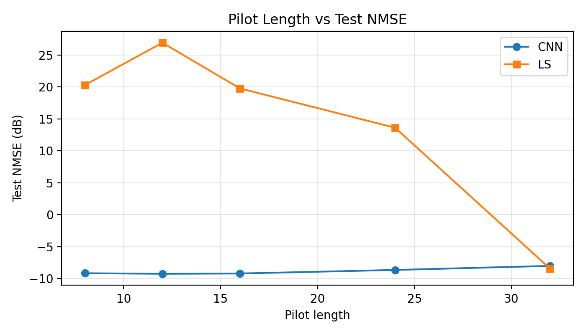
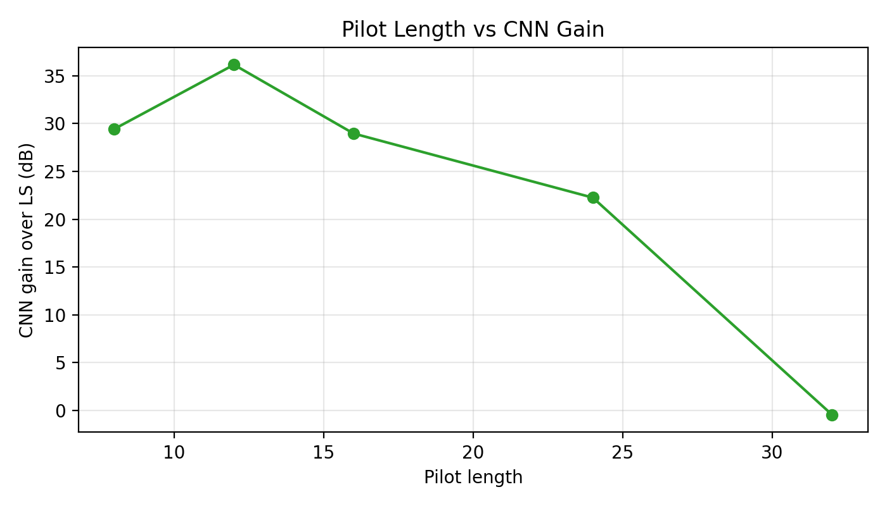
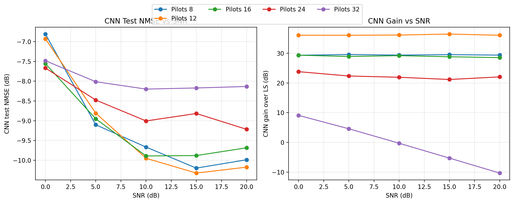
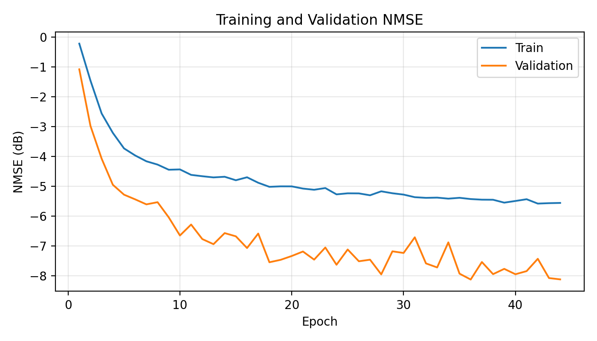
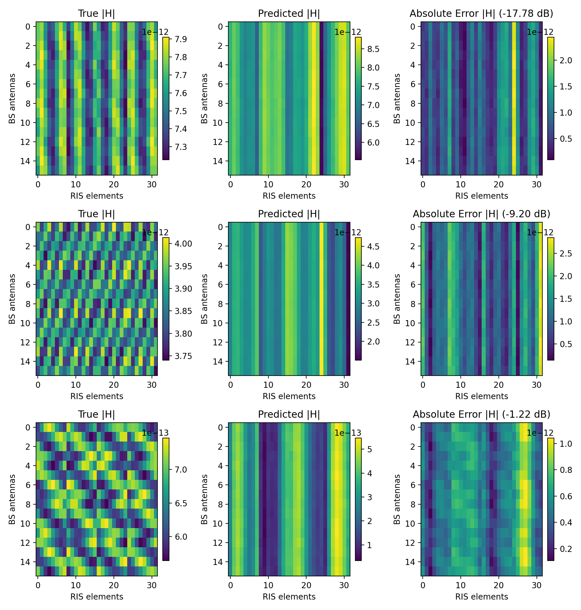

# Results and Output Interpretation

This document explains the stored reference experiment in [`data/runs/cnn_baseline/20260421-221441`](data/runs/cnn_baseline/20260421-221441). It is written from the actual run artifacts in that directory, not from a hypothetical setup.

> Main result: the compact CNN is decisively better than Least Squares in the pilot-limited regime (`Q < N = 32`), with the strongest point at `Q = 12`, where the CNN reaches `-9.238 dB` test NMSE and outperforms LS by `36.150 dB`. LS becomes competitive only when the pilot budget reaches the full RIS dimension (`Q = 32`).

## Experiment Snapshot

| Item | Value |
| --- | --- |
| Run directory | [`data/runs/cnn_baseline/20260421-221441`](data/runs/cnn_baseline/20260421-221441) |
| Dataset manifest | [`data/ris_mmwave_v1/manifest.json`](data/ris_mmwave_v1/manifest.json) |
| BS array | `4 x 4` UPA -> `M = 16` antennas |
| RIS array | `4 x 8` UPA -> `N = 32` elements |
| Channel target | Complex cascaded channel with shape `16 x 32` |
| Pilot lengths | `Q in {8, 12, 16, 24, 32}` |
| SNR grid | `{0, 5, 10, 15, 20}` dB, balanced across train/val/test |
| Samples per pilot length | `8000` train, `1000` val, `1000` test |
| RIS pilot design | DFT-derived codebook with default `2-bit` phase quantization |
| CNN | 3 convolution blocks `(32, 64, 64)` + FC head (`hidden_dim = 256`) |
| Optimizer | `AdamW`, `lr = 1e-3`, `weight_decay = 1e-4` |
| Early stopping | patience `8`, model selection by validation NMSE |
| Device used in this run | `mps` |

## What the Code Outputs

The training code writes two levels of outputs: cross-pilot experiment summaries at the run root and per-pilot diagnostics inside each `pilots_Q` directory.

### Run-Level Artifacts

| File | Technical meaning |
| --- | --- |
| [`experiment_summary.md`](data/runs/cnn_baseline/20260421-221441/experiment_summary.md) | Short text summary identifying the best pilot length and the best CNN-vs-LS gap. |
| [`pilot_length_summary.csv`](data/runs/cnn_baseline/20260421-221441/pilot_length_summary.csv) | One row per pilot budget. Contains the selected epoch, completed epochs, validation NMSE, test NMSE, LS baseline NMSE, and the CNN gain over LS. |
| [`pilot_length_vs_nmse.png`](data/runs/cnn_baseline/20260421-221441/pilot_length_vs_nmse.png) | Cross-pilot test-set comparison of CNN NMSE and LS NMSE in dB. This is the most compact view of whether learning helps or not. |
| [`pilot_length_vs_gain.png`](data/runs/cnn_baseline/20260421-221441/pilot_length_vs_gain.png) | Cross-pilot plot of `LS NMSE(dB) - CNN NMSE(dB)`. Positive values mean the CNN is better. |
| [`pilot_length_snr_comparison.png`](data/runs/cnn_baseline/20260421-221441/pilot_length_snr_comparison.png) | Two-panel summary. Left: CNN test NMSE versus SNR for each pilot length. Right: CNN gain over LS versus SNR for each pilot length. |

### Per-Pilot Artifacts

Each directory such as [`pilots_12`](data/runs/cnn_baseline/20260421-221441/pilots_12) contains:

| File | Technical meaning |
| --- | --- |
| `best.pt` | Checkpoint with the lowest validation NMSE for that pilot length. |
| `last.pt` | Final checkpoint at the end of training or early stopping. |
| `history.csv` | Epoch-by-epoch log with `epoch`, `lr`, `train_loss`, `val_loss`, `train_nmse`, `val_nmse`, `train_nmse_db`, and `val_nmse_db`. |
| `metrics.json` | Aggregate validation/test metrics for both CNN and LS, plus per-SNR breakdowns. |
| `normalization.json` | Channel and observation mean/std values used to standardize training and to denormalize predictions before reporting metrics. |
| `predictions.npz` | Denormalized saved arrays for the test split: `target`, `cnn_prediction`, `ls_prediction`, and `snr_db`. These are the best inputs for offline error analysis. |
| `plots/loss_curve.png` | Training and validation loss versus epoch. |
| `plots/nmse_curve.png` | Training and validation NMSE versus epoch. |
| `plots/snr_vs_nmse.png` | CNN-versus-LS test NMSE across the SNR grid for a fixed pilot length. |
| `plots/error_histogram.png` | Per-sample NMSE distribution comparison between CNN and LS. |
| `plots/channel_examples.png` | Magnitude-domain examples showing true channel, predicted channel, and absolute error maps. |

## Aggregate Performance Across Pilot Length

The table below is the core numerical summary from [`pilot_length_summary.csv`](data/runs/cnn_baseline/20260421-221441/pilot_length_summary.csv).

| Pilot length `Q` | Best epoch | Epochs completed | CNN val NMSE (dB) | CNN test NMSE (dB) | LS test NMSE (dB) | CNN gain over LS (dB) |
| --- | ---: | ---: | ---: | ---: | ---: | ---: |
| `8` | `43` | `51` | `-9.030` | `-9.153` | `20.281` | `29.434` |
| `12` | `36` | `44` | `-9.120` | `-9.238` | `26.912` | `36.150` |
| `16` | `31` | `39` | `-9.103` | `-9.193` | `19.765` | `28.958` |
| `24` | `19` | `27` | `-8.997` | `-8.637` | `13.615` | `22.253` |
| `32` | `20` | `28` | `-7.962` | `-8.001` | `-8.448` | `-0.447` |

### Immediate Reading of the Table

1. The CNN is remarkably stable for `Q = 8, 12, 16`, staying close to `-9 dB` NMSE even though the pilot budget changes by `2x`.
2. The strongest operating point in this run is `Q = 12`, not the longest pilot length.
3. LS is extremely poor for `Q < 32`, with NMSE values still positive in dB because the reconstruction problem is strongly underdetermined.
4. At `Q = 32`, the mean advantage disappears and LS slightly overtakes the CNN on average.

## Screenshots and Plots

### 1. Pilot Length vs Test NMSE

[Open full-size figure](data/runs/cnn_baseline/20260421-221441/pilot_length_vs_nmse.png)



This figure shows the clearest regime transition in the entire experiment:

- For `Q = 8, 12, 16, 24`, the CNN is far below the LS curve, meaning substantially lower estimation error.
- The CNN curve is relatively flat, which means it is not collapsing when pilots are scarce.
- LS improves monotonically as more pilots are provided, which is expected for a pseudoinverse-based estimator.
- The curves intersect only at `Q = 32`, where LS finally has enough measurements to compete strongly.

### 2. Pilot Length vs CNN Gain

[Open full-size figure](data/runs/cnn_baseline/20260421-221441/pilot_length_vs_gain.png)



This gain plot is useful because it removes the absolute scale and directly reports the benefit of learning over LS:

- Peak improvement occurs at `Q = 12` with `36.150 dB`.
- Even at `Q = 24`, the CNN still delivers a large `22.253 dB` advantage.
- The gain becomes slightly negative at `Q = 32`, which means the classical estimator is no longer the weak baseline once the pilot budget reaches the full RIS dimension.

### 3. SNR-Wise Comparison Across All Pilot Lengths

[Open full-size figure](data/runs/cnn_baseline/20260421-221441/pilot_length_snr_comparison.png)



The left panel shows CNN test NMSE versus SNR. The right panel shows CNN gain over LS versus SNR.

Key takeaways:

- `Q = 12` gives the best CNN curve across most of the SNR range.
- `Q = 8` and `Q = 16` are close behind, which suggests the CNN is exploiting prior structure more than raw pilot count in the underdetermined regime.
- `Q = 32` is the only setting where the gain curve crosses through zero and becomes negative at moderate/high SNR.

### 4. Best-Pilot Training Dynamics (`Q = 12`)

[Open full-size figure](data/runs/cnn_baseline/20260421-221441/pilots_12/plots/nmse_curve.png)



For the best run:

- the best checkpoint was selected at epoch `36`,
- training terminated after `44` epochs because early stopping patience was exhausted,
- most of the improvement happens early, followed by a slower refinement phase.

### 5. Example Channel Reconstructions (`Q = 12`)

[Open full-size figure](data/runs/cnn_baseline/20260421-221441/pilots_12/plots/channel_examples.png)



These examples are useful for understanding what the model output actually looks like:

- the left column is the ground-truth cascaded channel magnitude,
- the center column is the CNN prediction,
- the right column is the absolute error map,
- the per-example dB values in the titles indicate sample-level NMSE.

The prediction maps are smoother than the targets, which is consistent with a learned regularizer: the model preserves dominant spatial structure but does not reproduce every high-frequency fluctuation exactly.

## Technical Interpretation

### 1. Why the CNN Dominates for `Q < 32`

For this dataset, the RIS dimension is `N = 32`. When `Q < 32`, the measurement operator `Omega` does not span the full RIS space.

That matters because the LS baseline computes

```math
\hat{H}_{LS} = Y \Omega^H (\Omega \Omega^H)^{\dagger}
```

and when `Q < N`, the matrix `Omega Omega^H` is rank deficient. In practical terms:

- LS can only reconstruct the component of the channel that lies in the observed pilot subspace,
- the missing RIS-domain degrees of freedom must be implicitly treated as unobservable,
- this produces very large normalized error on the full `16 x 32` cascaded channel.

The CNN is solving a different problem. It does not analytically invert the observation operator per sample. Instead it learns an implicit prior over the synthetic channel family generated by this repository:

- sparse geometric BS-RIS channel,
- sparse RIS-UE channel,
- fixed geometry ranges,
- fixed path-count assumptions,
- fixed SNR grid,
- fixed pilot design.

That learned prior acts like a data-driven regularizer, which is why the CNN remains near `-9 dB` NMSE even when `Q` is only `8` or `12`.

### 2. Why `Q = 12` Is the Best Point in This Run

This result is important because it shows that the best operating point is not simply "use the most pilots available."

The measured behavior is:

- `Q = 8`: already strong, `-9.153 dB`
- `Q = 12`: best, `-9.238 dB`
- `Q = 16`: almost tied, `-9.193 dB`
- `Q = 24`: starts to weaken, `-8.637 dB`
- `Q = 32`: weakens further, `-8.001 dB`

One technically plausible explanation is that the CNN architecture scales unfavorably with pilot length because the dense head sees a flattened `64 x Q x M` feature map. Under the actual `M = 16`, `N = 32` configuration, this makes the model size grow from about `2.42M` parameters at `Q = 8` to about `8.71M` parameters at `Q = 32`. The experiment does not prove causality, but it does show that this fixed architecture is not monotonic with respect to pilot length.

### 3. Why LS Recovers at `Q = 32`

The `Q = 32` case is the turning point because the pilot dimension now matches the RIS dimension:

- the estimator is no longer underdetermined in the RIS domain,
- LS no longer needs to extrapolate a large unobserved subspace,
- at high SNR, a classical inversion-based estimator benefits from the richer measurements.

The mean result is:

- CNN test NMSE: `-8.001 dB`
- LS test NMSE: `-8.448 dB`
- CNN gain over LS: `-0.447 dB`

So the average advantage disappears.

However, the SNR-wise result is more nuanced. For `Q = 32`:

| SNR (dB) | CNN test NMSE (dB) | LS test NMSE (dB) | CNN gain over LS (dB) |
| --- | ---: | ---: | ---: |
| `0` | `-7.483` | `1.608` | `9.092` |
| `5` | `-8.014` | `-3.434` | `4.580` |
| `10` | `-8.201` | `-8.489` | `-0.289` |
| `15` | `-8.172` | `-13.464` | `-5.292` |
| `20` | `-8.135` | `-18.461` | `-10.326` |

This means:

- at low SNR, the CNN still behaves like a denoiser and wins,
- around `10 dB`, the two methods cross,
- at higher SNR, LS becomes substantially better because the observation system is informative enough and the model bias of the CNN becomes the limiting factor.

### 4. Why the Best CNN Gain Is So Large

For `Q = 12`, the improvement over LS is almost perfectly flat across SNR:

| SNR (dB) | CNN test NMSE (dB) | LS test NMSE (dB) | CNN gain over LS (dB) |
| --- | ---: | ---: | ---: |
| `0` | `-6.930` | `29.129` | `36.059` |
| `5` | `-8.809` | `27.249` | `36.058` |
| `10` | `-9.950` | `26.177` | `36.128` |
| `15` | `-10.324` | `26.132` | `36.456` |
| `20` | `-10.175` | `25.874` | `36.049` |

This is one of the most important signatures in the run. It says the dominant problem for LS at `Q = 12` is not just additive noise. The dominant problem is the structural lack of measurement dimension. Because LS is rank-limited, increasing SNR does not solve the missing-subspace problem. The CNN, by contrast, injects prior information learned from the training distribution and therefore keeps its error low across the entire SNR range.

### 5. What the Output Means for a Report or Thesis

If you want to describe this run in formal technical language, the strongest accurate statement is:

> The learned estimator provides a large advantage over LS whenever the RIS channel is observed through a pilot budget smaller than the RIS dimension. In that regime, LS is fundamentally subspace-limited, whereas the CNN exploits dataset-level structural priors to regularize the inverse problem. When the pilot budget reaches the full RIS dimension, the LS baseline recovers and eventually becomes superior at higher SNR, indicating that the CNN advantage is concentrated in the reduced-pilot regime rather than the fully observed regime.

That is the correct interpretation of the stored outputs.

## Recommended Figures to Use in a Report

If you only include three figures in a report, use these:

1. [`pilot_length_vs_nmse.png`](data/runs/cnn_baseline/20260421-221441/pilot_length_vs_nmse.png)
2. [`pilot_length_snr_comparison.png`](data/runs/cnn_baseline/20260421-221441/pilot_length_snr_comparison.png)
3. [`pilots_12/plots/nmse_curve.png`](data/runs/cnn_baseline/20260421-221441/pilots_12/plots/nmse_curve.png)

Those three together show:

- the global CNN-vs-LS outcome,
- the SNR dependence of that outcome,
- the training stability of the best-performing pilot configuration.
